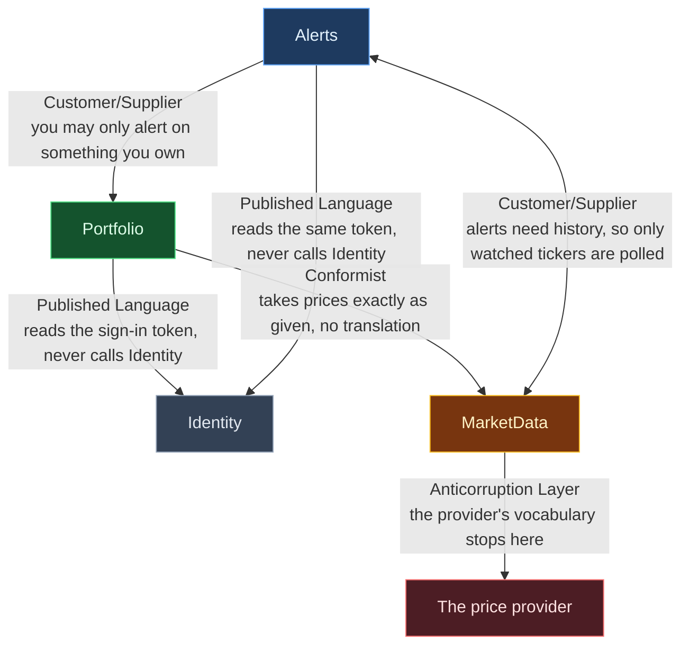
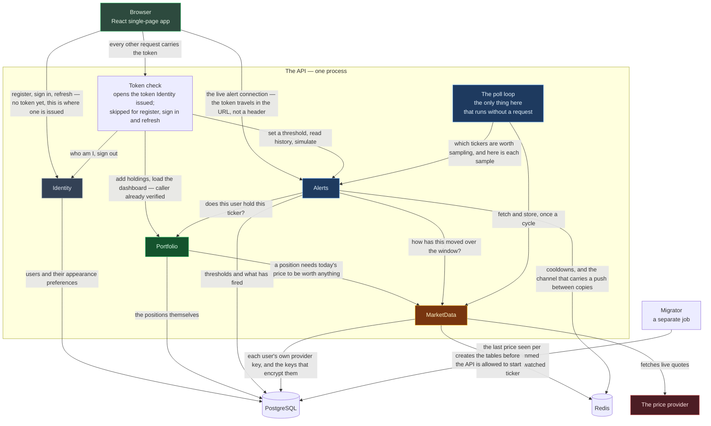

# StockPortfolio

A stock-portfolio tracker. You record the shares you own, see what they are worth right now and whether
you are up or down, and set a threshold on a position so the page tells you the moment it moves.
It is a .NET 10 modular monolith with a React single-page app in front of it, Postgres and Redis behind it.

---

## 1. Bounded contexts



An arrow points from the side that breaks to the side whose change breaks it. The lines are drawn by asking
whether each one would still work as a call over a network: nothing on two sides of a line is written in one
database transaction, the traffic across each is bounded, and either side can be down while the other keeps
going. Sharing a word does not merge two contexts — `Ticker` means the same thing in Portfolio, MarketData
and Alerts, and they are still three, because a threshold, a holding and a price are written on different
triggers and fail on their own. The one line into the outside world is the price provider, and its shapes and
names are translated once at the edge so they never reach the rest of the app.

---

## 2. Services at runtime



All four modules run in one process, so every line inside the box is an ordinary method call and only the
lines leaving it are real network hops. The token check sits outside Identity on purpose: the host opens the
sealed sign-in token and hands each request an identity, so nothing ever calls Identity to find out who is
asking. Each module connects to Postgres as its own database user with no rights on another module's schema,
so a query across a line is refused by the database rather than by a convention. The poll loop is drawn apart
from the modules because a timer reaches it rather than a request, and it is the only thing here that keeps
working when nobody is looking at the app.

---

## 3. The architecture

### What "modular monolith" means here

One process, one deployment, one `docker compose up`. Inside it the code is split into four modules —
**Identity**, **Portfolio**, **MarketData** and **Alerts** — with real boundaries, so any one of them could be
lifted out into its own service later without rewriting the others. The test for every boundary is whether it
would survive becoming a network call, which breaks into four questions: does anything on both sides have to
be written in one database transaction, is the number of calls across it bounded, can one side be down while
the other still works, and does exactly one module write each table.

There are **no domain events**. The only one ever planned existed to clear an alert cooldown when a holding
was deleted, and a cooldown expires by itself, so the event was deleted rather than the boundary.

### How a module is built

Each module is five projects. The solution has 31 projects in total, 7 of them test projects: four modules of
five, plus `Shared.Kernel`, `Shared.Api`, the `Host` and a `Migrator` console.

| Project | Holds | Who may see it |
|---|---|---|
| `.Contracts` | records of plain values, for other modules to use | everyone |
| `.Domain` | entities and the rules they enforce | its own module |
| `.Application` | commands, queries, handlers, and the abstractions Infrastructure fills in | its own module |
| `.Infrastructure` | the `DbContext`, repositories, outbound HTTP, Redis | its own module, mostly `internal` |
| `.Api` | HTTP endpoints, request records, validators | its own module |

Dependencies run one way: `.Api` → `.Application` → `.Domain` → `Shared.Kernel`, with `.Infrastructure`
plugged in at the bottom by the host. The two halves of a module meet only through the abstractions in
`.Application`, so an endpoint physically cannot reach a `DbContext` — the project reference does not exist.

Handlers are plain `ICommandHandler<,>` and `IQueryHandler<,>` injected straight into Minimal API endpoints;
there is no mediator, because there is one caller per handler and nothing to decouple. A handler returns a
union of its possible outcomes, and the endpoint has to write one branch per outcome, so adding a new failure
case breaks every call site until it is handled.

### The rules between modules

Three rules, and they are what keep the boundaries honest.

1. **A module may reference only another module's `.Contracts`.** Nothing deeper. The compiler cannot check
   this, because a module is five assemblies and `internal` is per-assembly, so most of a module has to be
   public. **An architecture test walking assembly references is the only thing enforcing it** — do not
   weaken or skip it on the assumption that the compiler has your back.
2. **`.Infrastructure` never references ASP.NET Core.** Inbound HTTP is presentation, not infrastructure.
3. **`.Api` never references EF Core**, nor its own `.Infrastructure`.

What crosses a line is plain values only — identifiers as raw `Guid`s and strings, numbers, no database types
and no wrapper types. A published type carrying a module's own identifier wrapper would drag a persistence
concern across with it.

The runtime dependency graph is three edges — Portfolio → MarketData, Alerts → MarketData, Alerts →
Portfolio. Nothing depends on Alerts, and nothing calls Identity at all: the sign-in token already carries
what anyone needs, which is why `Identity.Contracts` is empty and why Identity would be the cheapest module
to pull out. MarketData depends on nothing; it states two needs of its own — which tickers to sample, and
where a fresh sample goes — and the host answers both from Alerts, so the graph never cycles.

### Storage

**One `DbContext`, one Postgres schema and one database role per module, and all four now persist something.**
Identity holds users and appearance preferences, Portfolio holds positions, Alerts holds thresholds and fired
alerts, and MarketData holds each user's own provider key plus the encryption keys that seal them. There are
no foreign keys across schema lines — a holding's user is a plain identifier, checked by the application,
because the portfolio role cannot see the identity schema at all.

Database access goes through EF Core with no hand-written SQL anywhere. The brief only asks that queries be
parameterised; going through the ORM makes that structural, and the test suite proves it by watching every
command that reaches the database and asserting that no value a user typed is ever spliced into the statement
text.

### Prices: two questions, two paths

This is the decision most likely to be misread.

| Question | Who asks | How it is answered |
|---|---|---|
| What is this worth right now? | the dashboard, on load | ask the price provider directly, for this user's tickers |
| How has it moved over the last few minutes? | alert evaluation | sample on a timer, keep a short series in Redis |

**The dashboard never reads a cache first.** It asks the provider on every load, which is the opposite of a
read-through cache: the normal answer is fresh, and the stored value is only ever the failure path. Redis
holds one last-known price per ticker, used only as a fallback when a fetch fails, and served with its age
attached. The fallback is worked out per ticker, not per request — if three of twenty tickers fail, seventeen
fresh prices are still served and only three fall back.

The second path is the reason a poller exists at all, and it only polls tickers somebody has an active alert
on. With no alerts configured anywhere the cycle wakes, finds an empty list and calls nothing, and the
dashboard behaves exactly the same.

Money is a `decimal` on the server and travels to the browser as a string. Nothing about money is computed in
JavaScript — not totals, not profit and loss, not weights, not percentages — because a JSON number becomes a
floating-point value the moment the browser parses it.

### Alerts reach the browser over SignalR

When a threshold is crossed the alert is written to the database first and pushed second, over a SignalR hub
on a WebSocket. Redis carries the push between copies of the API, so an alert produced on one copy still
reaches a browser attached to another. The browser is pinned to WebSockets only and skips SignalR's
negotiate step, which together are what let the Redis backplane work without the platform having to send a
browser back to the same copy every time.

---

## 4. Technologies used

| Area | What | Why it is there |
|---|---|---|
| Runtime | .NET 10, C# | the modular monolith and its four modules |
| HTTP | ASP.NET Core Minimal APIs | endpoints per module, wired by one host |
| Real time | SignalR over WebSockets, with a Redis backplane | pushed alerts, and fan-out between copies of the API |
| Auth | ASP.NET Core Identity, sealed bearer tokens | register, sign in, refresh, sign out |
| Data | EF Core 10, Npgsql, PostgreSQL 18 | four contexts, four schemas, four roles, no raw SQL |
| Cache and messaging | Redis 8, StackExchange.Redis | last-known prices, the alert window, cooldowns, poll locks, fan-out |
| Outbound HTTP | `Microsoft.Extensions.Http.Resilience` (Polly) | retries that honour `Retry-After`, and a circuit breaker |
| Results | OneOf | a handler returns a union of its outcomes; every branch must be handled |
| Validation | FluentValidation, as an endpoint filter | shape checks that answer 400 before a handler runs |
| API description | `Microsoft.AspNetCore.OpenApi` | `/openapi/v1.json`, served in Development |
| Frontend | React 19, TypeScript, Vite 8 | the single-page app |
| Routing and data | TanStack Router, TanStack Query | client-side routes, and cached server state |
| Forms | React Hook Form, Zod | typed forms and client-side shape checks |
| Styling | Tailwind CSS v4 | **no UI component library at all** — the brief bans them, so every control is hand-built |
| Language | i18next, react-i18next | English and Ukrainian |
| Tests, server | xUnit v3, Shouldly, Testcontainers, `FakeTimeProvider` | unit, architecture and integration suites |
| Tests, browser | Vitest, Testing Library, MSW | the SPA's own suite |
| Local stack | Docker Compose | Postgres, Redis, a migration job, the API and the SPA |
| Deployment | Azure Container Apps for the API, GitHub Pages for the SPA, Bicep and GitHub Actions | one push to `main` deploys everything |

---

## 5. Running it locally

```bash
git clone <repo> && cd StockPortfolio
docker compose up
```

That one command brings up everything — the SPA on <http://localhost:5173>, the API on
<http://localhost:8080>, Postgres, Redis and the migration job that creates the tables before the API is
allowed to start. **No API key is needed**: with no `Finnhub__ApiKey` set the app uses a fake quote provider
that generates plausible prices and logs a warning, which is what lets a clean clone run with no registration
anywhere. Copy `.env.example` to `.env` only if you want to change passwords or ports — every compose variable
already has a working default.
