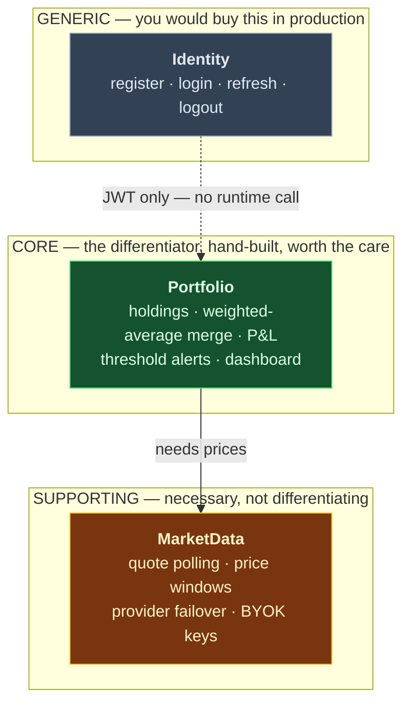
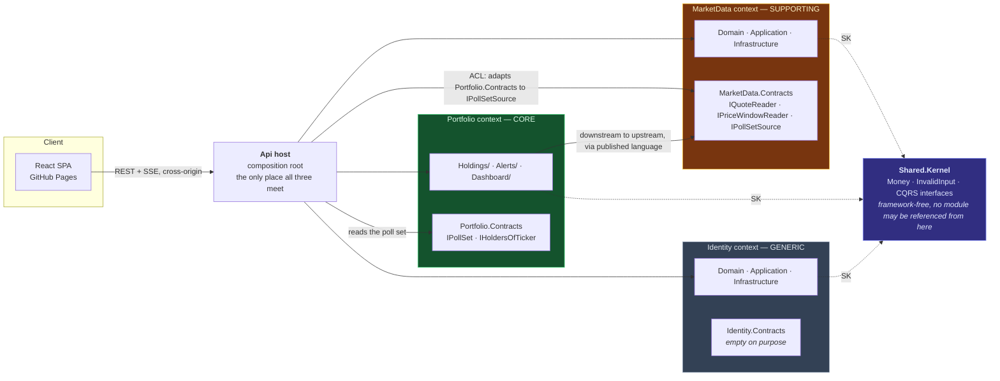
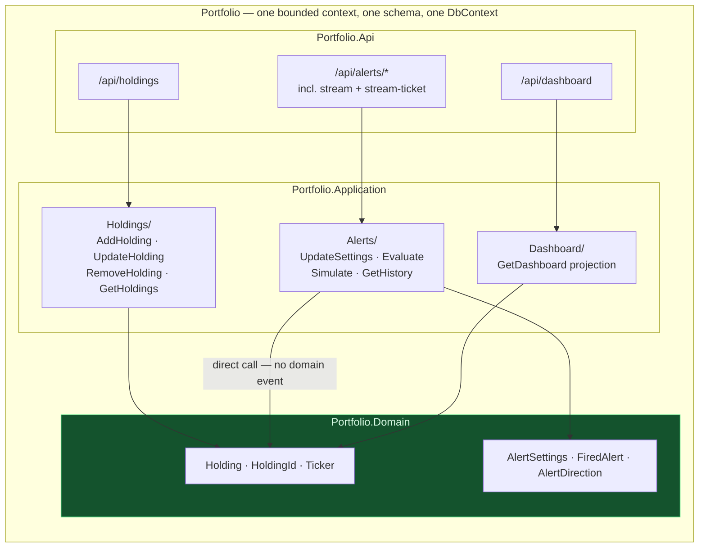
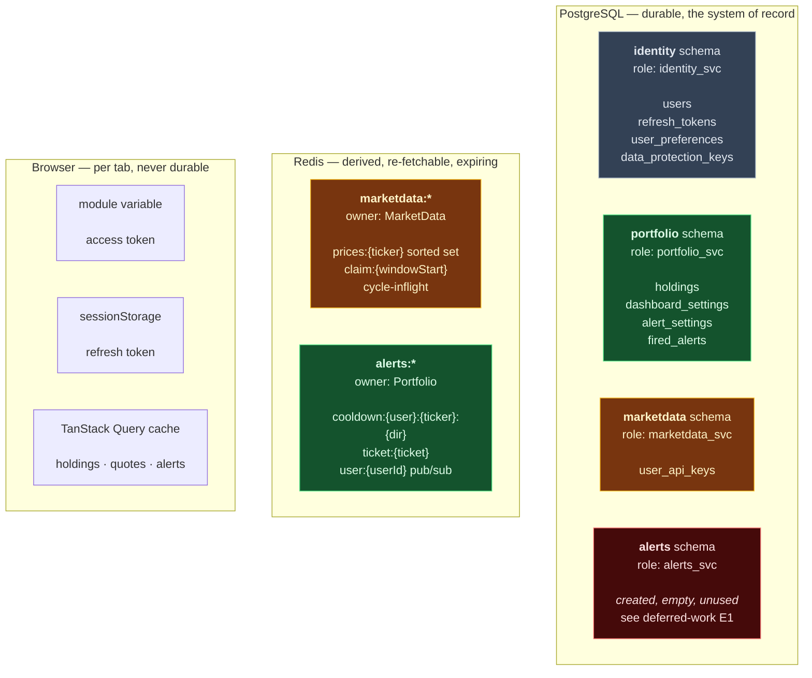

# Bounded contexts, subdomains and storage ownership

Three views that the other reference files do not carry: **which subdomain each module is**, **how the
contexts relate** in DDD terms, and **who owns which byte** across Postgres, Redis and the browser.

Companions, not duplicates:
- [module-interactions.md](module-interactions.md) — the project-level dependency graph and runtime sequences
- [er-diagram.md](er-diagram.md) — column-level table shapes, indexes and the migration-history trap
- [00-overview.md](00-overview.md) §"Three modules, not four" — the argument for the current shape

> **Written after the Phase 2 reversal.** The project shipped its plan with four modules and cut that to
> three by folding Alerts into Portfolio. `Ticker` meant a stock symbol in Portfolio, in MarketData and in
> Alerts identically — no language divergence, so it was never three contexts. This file describes what
> exists now.

---

## 1. Subdomain classification

A bounded context is a *language* boundary. A subdomain is a *business* one: how much of your competitive
advantage lives there, and therefore how much it deserves to be hand-built.



| Subdomain | Module | Why it is classified this way | What that buys |
|---|---|---|---|
| **Core** | `Portfolio` — holdings **and** alerts | The weighted-average merge rule and the threshold behaviour built on top of it are the only things here a reviewer could not get from a template | Richest domain model, most tests, the only module with two feature areas |
| **Supporting** | `MarketData` | Every tracker needs quotes; none competes on fetching them. But it has its own lifecycle — timer-driven, external API, rate limits, a distinct failure mode | Kept separate so its failure mode (stale feed, dead provider) is isolated and degradable |
| **Generic** | `Identity` | Register/login/refresh is a solved problem you would buy — Entra ID, Auth0, Keycloak | Deliberately boring, and the cheapest module to delete later: nothing calls it at runtime |

**Alerts is not a subdomain of its own.** It is a feature area inside the core context. Alerting on a
threshold is the portfolio's own behaviour, expressed in the portfolio's own language — a holding, a ticker,
a price move — with nothing translated on the way in.

---

## 2. Context map

Relationship patterns in the usual DDD notation: **U** upstream, **D** downstream, **PL** published
language, **ACL** anticorruption layer, **SK** shared kernel.



| Relationship | Pattern | What it means here |
|---|---|---|
| Portfolio → MarketData | **Customer / Supplier** + **Published Language** | Portfolio is the downstream customer. It speaks only `MarketData.Contracts` — records of primitives — never MarketData's domain types |
| Host → MarketData | **Anticorruption Layer** | MarketData declares `IPollSetSource` as *its own* need. The host writes the ten-line adapter over `Portfolio.Contracts`. This inversion is what keeps the graph acyclic — without it, the two would be mutually dependent |
| Identity → everything | **Separate Ways** at runtime | Nothing calls Identity during a request. The JWT is the entire integration, and `Identity.Contracts` is empty to prove it |
| Everything → Shared.Kernel | **Shared Kernel** | Deliberately tiny: `Money`, `InvalidInput`, two CQRS interfaces. Anything larger and the kernel becomes the shared domain, which is what modules exist to prevent |

**The graph is one edge.** Portfolio → MarketData, with Identity off to the side. That is the extraction
order read off the structure rather than argued: Identity is cheapest to pull out (nothing points at it),
MarketData is dearest (Portfolio depends on it synchronously on two paths, so extracting it puts a network
hop on every dashboard render).

---

## 3. Inside the core context

The merge did not flatten anything — it removed a project boundary and kept the folder one. Feature areas
are the established convention: Identity's is `Authentication/`.



The arrow marked *direct call* is the whole reason for the merge. When Alerts was its own module it could
not reach `Holding`, so removing a position had to be announced as a `HoldingRemoved` domain event — which
required `IDomainEvent`, a publisher, a `SaveChangesInterceptor`, a dispatch-timing decision and six tests.
Inside one context it is a method call, and all of that is deleted.

---

## 4. Storage ownership

Three stores, and the rule is the same in each: **one owner, no reaching across.**



### PostgreSQL — what lives where

| Schema · role | Table | Holds | Phase |
|---|---|---|---|
| **identity** · `identity_svc` | `users` | email, argon2id PHC hash | 1 |
| | `refresh_tokens` | SHA-256 hash, rotation chain | 1 |
| | `user_preferences` | theme, language | 5 |
| | `data_protection_keys` | the key ring — persist it or BYOK ciphertext is orphaned on redeploy | 5 |
| **portfolio** · `portfolio_svc` | `holdings` | quantity, weighted average price, `is_visible` | 2 |
| | `alert_settings` | enabled, threshold %, window minutes | 4 |
| | `fired_alerts` | direction, change %, trigger and reference price | 4 |
| | `dashboard_settings` | client refresh interval | 5 |
| **marketdata** · `marketdata_svc` | `user_api_keys` | Data-Protection-encrypted Finnhub key, last four | 5 |
| **alerts** · `alerts_svc` | — | Nothing. Created by `db/init/` before the merge; no connection string points at it | — |

Two rules make those boundaries real rather than decorative:

**No foreign keys across schemas.** `portfolio.holdings.user_id` cannot be a real FK to `identity.users.id` —
each role has no `USAGE` on the others, so the constraint would fail to create. Cross-schema references are
plain `Guid`, enforced by the application. Wanting a real FK across a schema line means the design has drifted.

**Role isolation is asserted, not assumed.** `PortfolioRole_CannotReadIdentitySchema` connects as
`portfolio_svc`, selects from `identity.users` and asserts SQLSTATE `42501`. That converts a design claim
into a fact CI re-checks.

### Redis — what lives where, and why it is not in Postgres

| Key | Type | Owner | Lifetime | Why not a table |
|---|---|---|---|---|
| `marketdata:prices:{ticker}` | Sorted set, member `"{epochMs}:{price}"` | MarketData | Trimmed to ~61 entries (1h 1m) | Derived and re-fetchable; losing it costs alert history until the window refills, not money |
| `marketdata:claim:{windowStart}` | String | MarketData | `EX 120` | Decides *who* polls a window across replicas — a lock, not data |
| `marketdata:cycle-inflight` | String | MarketData | `EX 110`, deleted in `finally` | Decides *whether* any cycle is running; closes the overrun gap the window claim cannot |
| `alerts:cooldown:{user}:{ticker}:{dir}` | String | **Portfolio** | `EX` = the user's cooldown | Expiry *is* the semantics. A table needs a cleanup job to do the same thing worse |
| `alerts:ticket:{ticket}` | String | **Portfolio** | `EX 30`, deleted on first use | Single-use SSE handshake token; `EventSource` cannot send headers |
| `alerts:user:{userId}` | Pub/sub channel | **Portfolio** | — | Fans a fired alert to whichever replica holds that user's stream |

⚠️ The `alerts:` prefix names the **feature**, not a module. Portfolio owns those keys. It was left unrenamed
deliberately — renaming would invalidate live keys to no benefit.

The sorted-set member is `timestamp:price`, never the bare price. Members must be unique: a ticker hitting
the same value twice would update the existing entry's score instead of adding a row, silently erasing the
earlier reading.

### Browser — and the thing that is *not* stored

| Where | What | Why there |
|---|---|---|
| Module-scoped variable (memory) | Access token | Not in web storage. An XSS then has to be live and resident to steal it, rather than walking storage once |
| `sessionStorage` | Refresh token | Tab-scoped and dies with the tab, so a shared machine does not leak a live session. `localStorage` would hand over a 14-day credential |
| TanStack Query cache (memory) | Holdings, quotes, alert history | Server state, never a source of truth |
| `BroadcastChannel` | *nothing* — it is transport | Hands the session between tabs without a shared store |

⚠️ **There is no cookie anywhere.** The server sets none; every auth endpoint returns the token pair in the
body. An httpOnly cookie would be stronger and is unavailable: the SPA is on `github.io` and the API on Azure
Container Apps, so it would be third-party, and Safari blocks those outright. Some older comments in
`apiClient.ts` and `nginx.conf` still describe a dual-mode cookie design that was never built —
`src/Web/src/lib/tokenStore.ts` is the corrected account.

**Money is never computed in the browser.** Amounts cross the wire as strings, because `System.Text.Json`
writes `decimal` as a JSON number and `JSON.parse` turns it into a double, destroying server-side decimal
maths at the boundary. Totals, weights and P&L are all computed server-side.

---

## 5. Connection budget

Azure Postgres B1ms allows **35 user connections**, and a different `Username` is a different Npgsql pool.
Every connection string carries `Maximum Pool Size=2`:

```
2 replicas × 3 roles × 2 connections = 12,  leaving 23 headroom
```

Npgsql's default of 100 would request 600. PgBouncer is unavailable on Burstable, so there is no escape
hatch below this. `alerts_svc` exists in the database but has no connection string, so it opens no pool.
