# Data model

Four Postgres schemas, one per module. Price observations are **not** here — they live in Redis (§3).

> **Reversal, twice.** Phase 2 moved the alert tables into the `portfolio` schema when Alerts was merged
> into Portfolio; that merge was reversed, so `alert_settings` and `fired_alerts` are back in the **`alerts`**
> schema, in `AlertsDbContext`, reached by `alerts_svc` — which `db/init/` has been creating all along.
> Separately, `alert_settings` is now keyed on **user + ticker** rather than one row per user, so a threshold
> belongs to a position rather than to an account. See [module-boundaries.md](module-boundaries.md).

## The rule that shapes this diagram

**There are no foreign keys across schemas.** Each module connects as its own database role with no `USAGE` on the others, so `portfolio.holdings.user_id` *cannot* be a real FK to `identity.users.id` — the constraint would fail to create, and the query to validate it would fail with a permission error.

So the diagram uses two line styles: **solid** for a real foreign key enforced by Postgres inside one schema, **dashed** for a logical reference across a module boundary enforced only by the application. That distinction is the module boundary made visible. If you find yourself wanting a solid line across schemas, the design has drifted.

---

## Schema

```mermaid
erDiagram
    identity_users {
        uuid id PK "UUIDv7, generated in domain"
        text email UK "lowercased on Create"
        text password_hash "argon2id PHC string"
        timestamptz created_at
    }

    identity_refresh_tokens {
        uuid id PK
        uuid user_id FK
        bytea token_hash UK "SHA-256 of the opaque token"
        timestamptz expires_at
        timestamptz created_at
        timestamptz superseded_at "null while active"
        uuid superseded_by "rotation chain"
    }

    identity_user_preferences {
        uuid id PK
        uuid user_id FK,UK "one row per user"
        text theme "Light | Dark | System"
        text language "En | Uk"
    }

    identity_data_protection_keys {
        int id PK
        text friendly_name
        xml key_data "persist it or BYOK ciphertext is orphaned on redeploy"
    }

    portfolio_holdings {
        uuid id PK
        uuid user_id "logical FK to identity.users"
        text ticker "uppercase, ^[A-Z]{1,5}$"
        numeric quantity "18,6 — fractional shares"
        numeric avg_price_amount "18,6 — weighted average"
        char avg_price_currency "3, fixed"
        boolean is_visible "req 8 — show/hide on the dashboard"
        timestamptz created_at
        timestamptz updated_at
    }

    portfolio_dashboard_settings {
        uuid id PK
        uuid user_id UK "logical FK"
        int refresh_interval_seconds "10..300 — CLIENT poll cadence only"
    }

    marketdata_user_api_keys {
        uuid id PK
        uuid user_id UK "logical FK"
        bytea encrypted_key "Data Protection — never returned"
        char last_four "4, the only part ever shown"
        timestamptz validated_at "live /quote check at save time"
    }

    alerts_alert_settings {
        uuid id PK
        uuid user_id "logical FK — Alerts owns this, not Identity"
        text ticker "one threshold per position, not per account"
        boolean enabled
        numeric threshold_percent "5,2 — 0.1..50"
        int window_minutes "1..60, must be < retention"
    }

    alerts_fired_alerts {
        uuid id PK
        uuid user_id "logical FK"
        text ticker
        text direction "Drawdown | RunUp"
        numeric change_percent "5,2"
        numeric trigger_price "18,6 — the price that fired it"
        numeric reference_price "18,6 — the window extreme it was measured against"
        char currency "3"
        timestamptz fired_at
        boolean is_simulated "manual trigger endpoint"
    }

    identity_users ||--o{ identity_refresh_tokens : "owns"
    identity_users ||--o| identity_user_preferences : "has"

    identity_users ||..o{ portfolio_holdings : "user_id — no FK"
    identity_users ||..o| portfolio_dashboard_settings : "user_id — no FK"
    identity_users ||..o| marketdata_user_api_keys : "user_id — no FK"
    identity_users ||..o{ alerts_alert_settings : "user_id — no FK"
    identity_users ||..o{ alerts_fired_alerts : "user_id — no FK"
```



Seven tables plus the Data Protection key ring. Two tables from an earlier draft are gone, and it is worth saying why so they don't creep back:

**`marketdata.tracked_tickers`** — `Initial.md:74` gives MarketData its own table of distinct tickers, maintained by subscribing to holding events. Once the poller reads its ticker list live from Alerts at the start of each cycle, that table is duplicated state with no job — and it was the reason for the event subscription, the periodic reconciliation, and the whole "a lost publish diverges the two permanently" failure mode. All three go with it.

**`alerts.cooldowns`** — moved to Redis as `alerts:cooldown:{userId}:{ticker}:{direction}` with a TTL. Expiry is the entire semantics of a cooldown, so a store with native expiry is the right one; a table needs a cleanup job to do the same thing worse. The Redis key prefix stays `alerts:` even though the owning module is now Portfolio — it names the feature, and renaming it would invalidate live keys for nothing.

---

## Indexes that carry weight

`portfolio.holdings` needs `UNIQUE (user_id, ticker)` — that is the merge rule's only real guarantee, because a `SELECT` then `INSERT` in the handler is a race. Catch `23505` and route to the merge path.

`identity.users` needs `UNIQUE (email)` for registration conflict detection, and `identity.refresh_tokens` needs `UNIQUE (token_hash)` plus a partial index on `superseded_at IS NULL` so rotation lookups only touch active tokens.

`alerts.fired_alerts` needs `(user_id, fired_at DESC)` — the history endpoint is the only thing that reads it, and it reads it exactly one way.

---

## Migration history — the trap

Each `DbContext` needs its own history table:

```csharp
npg.MigrationsHistoryTable("__EFMigrationsHistory", "identity");   // and portfolio, marketdata, alerts
```

`HasDefaultSchema` does **not** move `__EFMigrationsHistory` ([efcore#24127](https://github.com/dotnet/efcore/issues/24127), closed *not planned*). Without this line all four contexts share `public.__EFMigrationsHistory`, each sees the others' migration IDs in the applied list, and `database update` reports migrations as applied-but-missing. It looks like data corruption.

---

## Roles and grants

```
migrator          OWNER of all four schemas, CREATE  — used only by the migration job
identity_svc      DML on identity.*      only
portfolio_svc     DML on portfolio.*     only
marketdata_svc    DML on marketdata.*    only
alerts_svc        DML on alerts.*        only
```

`REVOKE ALL ON SCHEMA <other> FROM <role>` for every pair. A cross-schema query then fails at runtime, in CI, on the first test run — which is what `Api.IntegrationTests.PortfolioRole_CannotReadIdentitySchema` asserts.

⚠️ **Connection budget.** Azure Postgres B1ms allows **35 user connections**, and a different `Username` is a different Npgsql pool. Every connection string carries `Maximum Pool Size=2`: 2 replicas × 4 roles × 2 = 16, leaving 19 headroom. Npgsql's default of 100 would request 800. PgBouncer is unavailable on Burstable, so there is no escape hatch below this.

---

## 3. What lives in Redis instead

Price observations are derived and re-fetchable, so losing them costs alert history until the window refills — not accounts, not holdings, not money. That risk profile is what licenses a different store.

| Key | Type | Contents | Lifetime |
|---|---|---|---|
| `marketdata:last:{ticker}` | String | `"{price}:{epochMs}"` — the last price any path fetched | **Never trimmed.** The dashboard's only fallback when the provider is unreachable |
| `marketdata:prices:{ticker}` | Sorted set | Member `"{epochMs}:{price}"`, score `epochMs` | Trimmed on write to 1h 1m ≈ 61 entries. Written only for tickers with an active alert |
| `marketdata:claim:{windowStart}` | String | `"1"` — decides *who* polls this window | `EX 120` |
| `marketdata:cycle-inflight` | String | Instance id — decides *whether* any cycle is running | `EX 110`, deleted in `finally` |
| `alerts:cooldown:{user}:{ticker}:{dir}` | String | `"1"` — presence means suppressed | `EX` = the user's cooldown |
| `alerts:ticket:{ticket}` | String | User id for the SSE handshake | `EX 30`, deleted on first use |
| `alerts:user:{userId}` | Pub/sub channel | Fired alert payloads, fanned out to whichever replica holds the stream | — |

The sorted-set member is `timestamp:price`, not `price`. Members must be unique — if the member were the bare price, a ticker hitting the same value twice would **update the existing entry's score rather than adding a new one**, silently erasing the earlier reading.

**The two price structures are separate on purpose, and it is not redundancy.** `last:` answers *what is it worth*, `prices:` answers *how has it moved*, and their lifetimes differ — one is kept for as long as someone might look, the other is trimmed to an hour and only exists while an alert does. Turn alerts off for a ticker and it has no window at all, which is exactly when the dashboard still needs a fallback. Collapsing them would also couple the dashboard's degradation to the alert retention setting.

The two claim keys are separate on purpose. The window claim guarantees one winner *within* a window and says nothing *across* windows, so a cycle that overruns is still fetching when the next window opens and a different replica claims it. The in-flight guard closes that. See [phase-3-live-prices.md](phase-3-live-prices.md) §2.4.
