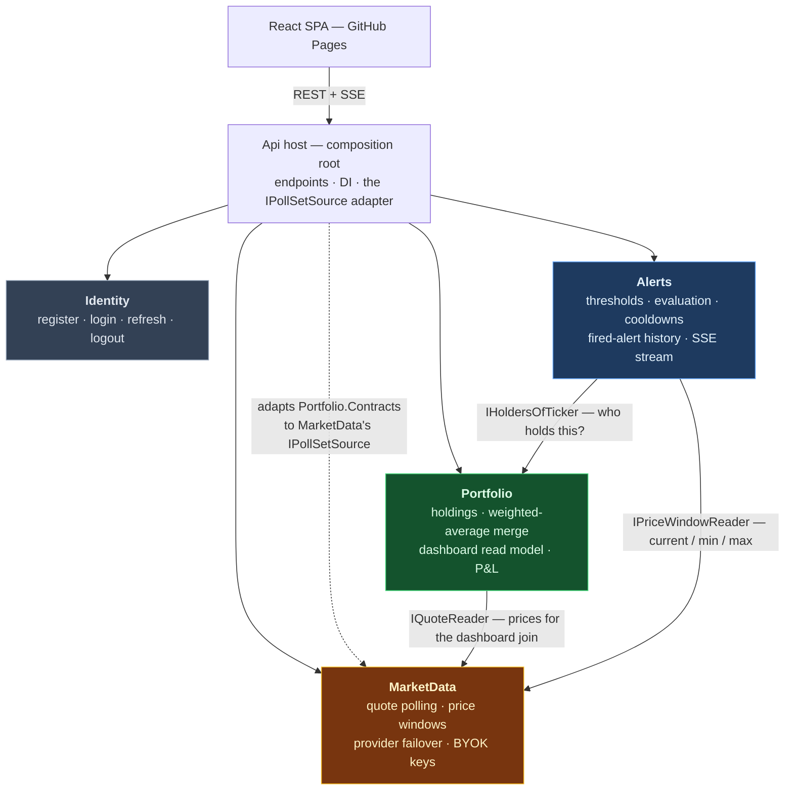
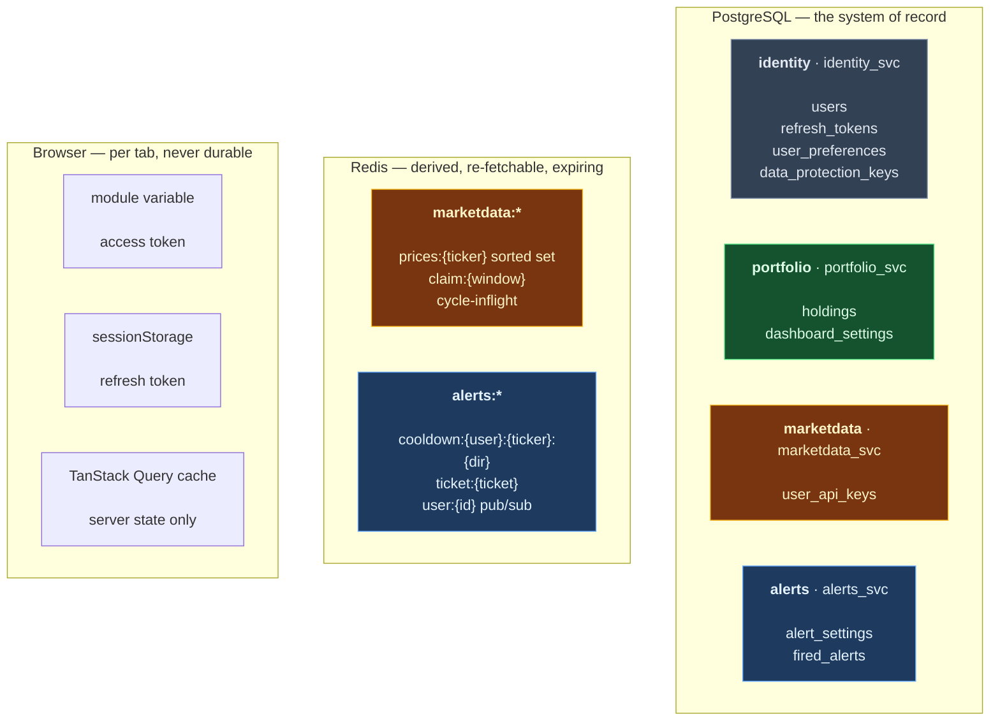

# Module boundaries — the criterion, and where it was and was not applied

Four modules: **Identity**, **Portfolio**, **MarketData**, **Alerts**. This file says what each one holds,
why the lines fall where they do, and — more usefully — the three places a line could have been drawn and
deliberately was not.

Companions: [module-interactions.md](module-interactions.md) for the runtime sequences and deployment
topology, [er-diagram.md](er-diagram.md) for column-level table shapes.

---

## 1. The criterion

A modular monolith exists so that boundaries are real now and *could* become network boundaries later,
without paying distribution costs today. So the test for every seam is: **would it survive becoming a
network call?**

Four questions, all checkable:

| # | Question | A seam fails if… |
|---|---|---|
| 1 | **Shared transaction** — must anything on both sides be written atomically? | yes; two things in one transaction belong in one module |
| 2 | **Chattiness** — how many calls cross it, and are they cacheable or batchable? | it is per-row, uncacheable, and on a hot path |
| 3 | **Independent failure** — can one side be down while the other degrades rather than breaks? | one side going down takes the other with it |
| 4 | **Single writer** — does exactly one module write each table? | two modules write the same rows |

This is used instead of classifying modules as core / supporting / generic subdomains. That vocabulary is
real DDD — `Core Domain` and `Generic Subdomain` are Evans (2003) ch. 15, `Supporting Subdomain` is Vernon
(2013) — but applying it here changed **not one line of code**, and "which of these is the core domain" is a
label, not a decision. The four questions above changed real ones.

One clarification the earlier draft of this file got wrong, and it is worth stating: a **subdomain** is a
slice of the problem space, a **bounded context** is a model boundary, and a **module** in Evans' sense is a
namespace *inside* a context. This project uses "module" in the modular-monolith sense — a group of five
projects with its own schema. Calling one of them "the core module" collapsed three different ideas into one.

---

## 2. The four modules



Read the graph two ways and it says the same thing both times:

- **Nothing depends on Alerts**, and **Alerts depends on two things**. It is a pure consumer — the leaf of
  the graph, and therefore the module whose internals nobody else can be broken by.
- **MarketData depends on nothing.** It needs to know which tickers to poll, but declares that need as its
  own interface, `IPollSetSource`, and the host supplies a ten-line adapter over `Portfolio.Contracts`.
  Without that inversion Portfolio and MarketData would be mutually dependent and the graph would cycle.
- **Nothing calls Identity at runtime.** The JWT is self-contained, so `Identity.Contracts` is empty — the
  emptiness is the evidence.

Every arrow is a synchronous call through a contract interface holding records of primitives — raw `Guid`
and `string`, no strongly-typed ids, no EF types. **There are no domain events anywhere in the system**; see
§5.

---

## 3. What is in each module

### Identity — signing in

| | |
|---|---|
| **Entities** | `User` (email, argon2id PHC hash), `RefreshToken` (SHA-256 hash, rotation chain, supersede/revoke) |
| **Later** | `UserPreferences` (theme, language) |
| **Endpoints** | `POST /api/auth/{register,login,refresh,logout}` · `GET /api/auth/me` |
| **Postgres** | `identity` — users, refresh_tokens, user_preferences, data_protection_keys |
| **Depends on** | nothing |
| **Depended on by** | nothing at runtime |

The only module with no inbound runtime coupling, which makes it the cheapest to extract: a new host, a
Dockerfile, its own connection string, one swapped DI registration.

### Portfolio — what you own and what it is worth

| | |
|---|---|
| **Entities** | `Holding` — one row per `(user_id, ticker)`, enforced by a unique index |
| **Value objects** | `Ticker`, `HoldingId`, `Money` |
| **Rules** | `Merge` averages (a further purchase), `Correct` replaces (a mistyped entry). Quantity ≥ 0.000001, price > 0, one currency per position |
| **Read model** | dashboard projection — market value, cost, profit in currency and percent, weight, freshness |
| **Endpoints** | `/api/holdings` CRUD · `/api/dashboard` |
| **Postgres** | `portfolio` — holdings, dashboard_settings |
| **Depends on** | MarketData, for prices |
| **Exposes** | `IHoldersOfTicker`, `IPollSet` |

`Merge` versus `Correct` is the one place the domain language does real work: "I bought more" and "I typed
it wrong" touch the same two fields and mean different things, and folding them behind one flag is how a
correction silently becomes a purchase.

### MarketData — where prices come from

| | |
|---|---|
| **Value objects** | `Quote(Ticker, Price, ObservedAt)`, its own `Ticker` |
| **Entities** | `UserApiKey` — BYOK, Data-Protection encrypted, never returned to the browser |
| **Behaviour** | 60-second poller, read-through on cache miss, provider failover, client-side rate limiting, a fake provider that is the default when no API key is set |
| **Redis** | `marketdata:prices:{ticker}` sorted sets, `marketdata:claim:{window}`, `marketdata:cycle-inflight` |
| **Postgres** | `marketdata` — user_api_keys |
| **Depends on** | nothing |
| **Exposes** | `IQuoteReader`, `IPriceWindowReader` |

Worth being honest about: **MarketData has almost no domain model.** `Quote` is a value object in name and a
timestamped DTO in substance, and its rules are integration policy — retention must exceed the longest alert
window, an all-zero Finnhub response means an unknown symbol rather than a $0 price, staleness thresholds,
circuit-breaker states. That thinness is exactly why it is a good extraction candidate: it is a bought-or-built
capability with a cache in front, not a place where the product is differentiated.

### Alerts — noticing a move and telling you

| | |
|---|---|
| **Entities** | `AlertSettings` (enabled, threshold %, window minutes), `FiredAlert` (direction, change %, trigger price, reference price) |
| **Value objects** | `AlertDirection` (Drawdown \| RunUp), its own `Ticker` |
| **Behaviour** | evaluation after each poll cycle, cooldown suppression, SSE stream with a single-use ticket handshake, a simulate endpoint |
| **Redis** | `alerts:cooldown:{user}:{ticker}:{dir}`, `alerts:ticket:{ticket}`, `alerts:user:{id}` pub/sub |
| **Postgres** | `alerts` — alert_settings, fired_alerts |
| **Depends on** | Portfolio (`IHoldersOfTicker`), MarketData (`IPriceWindowReader`) |
| **Depended on by** | nothing |

The threshold is measured against **the extreme of your own window**, never against Finnhub's `dp`, which is
change versus the previous session close — a different question in the same units.

---

## 4. Where a line was deliberately **not** drawn

This section is the point of the file. Splitting everything is not judgement; knowing where to stop is.

### The dashboard read model stays inside Portfolio

It reads the same `Holding` rows the write side owns, joined in memory with prices from MarketData. Test 1
answers itself — same aggregate, same writer — and test 4 says there is exactly one writer for `holdings`.
Extracting it would put a network hop between a query and the rows it queries and buy nothing.

### There is no Settings module

The mockup has one Settings *screen*, which is a UI grouping, not a boundary. Each setting lives with the
thing it configures:

| Setting | Owner | Because |
|---|---|---|
| theme, language | Identity | properties of the person, not of any feature |
| dashboard refresh interval, position visibility | Portfolio | properties of the portfolio view |
| threshold percent, window minutes | Alerts | properties of the alert rule |
| BYOK provider key | MarketData | configures the quote provider |

A Settings module would own rows that four other modules read, which fails test 4 outright — four readers,
one writer, and every schema boundary punctured to reach it. The screen composes four independent calls
instead, which also means a rejected BYOK key cannot discard a perfectly good theme change.

### MarketData keeps the BYOK keys rather than Identity holding them

They look like user data and are stored per user, so Identity is the tempting home. But the key *configures
the quote provider*, MarketData is the only module that can validate it (one live `/quote` call at save
time) and the only one that ever uses it. Putting it in Identity would mean Identity storing a secret it
cannot check and never reads.

### `alert_settings` lives in Alerts, not Identity

Same reasoning, and it is worth stating because `docs/Initial.md` put it in Identity. Alerts is the only
module that reads it, and it changes when the alerting rules change.

---

## 5. What was reversed on the way here, and what it taught

Phase 2 merged Alerts into Portfolio, and then this reverted it. The record matters more than the outcome.

**The merge's argument was:** `Ticker` means a stock symbol in Portfolio, in MarketData and in Alerts
identically, so there was no language divergence, so it was one bounded context split three ways.

**Why that is invalid:** language divergence is a *sufficient* condition for concluding two contexts exist.
It is not a *necessary* one. Two contexts can share a vocabulary completely and still be two contexts,
because they change for different reasons, are written on different triggers, or fail independently. A bank's
Statements and Fraud Detection contexts both mean the same thing by "Account" and nobody merges them. The
merge used a valid test in an invalid direction.

**What the merge was actually reacting to, and the part it got right:** `HoldingRemoved` was the only domain
event in the entire six-phase plan, and it existed solely so that deleting a holding could tell Alerts to
clear a Redis cooldown key. That single event dragged in `IDomainEvent`, a publisher, a
`SaveChangesInterceptor`, a dispatch-timing decision and six tests. It was real, disproportionate complexity.

**The fix was to delete the event, not the boundary.** A cooldown key has a TTL — it expires on its own.
Not clearing it costs, at worst, one suppressed alert if the user re-buys the same ticker inside the window.
So the boundary comes back and **the domain-event infrastructure stays deleted**: `Shared.Kernel` has no
`IDomainEvent`, nothing raises one, and Alerts learns about removed holdings by simply not finding them in
`IHoldersOfTicker` on the next cycle.

Applied to the four tests, the Portfolio/Alerts seam passes all of them: no shared transaction (`FiredAlert`
is never written atomically with `Holding`), bounded and batchable chattiness (one holders lookup per ticker
per cycle), independent failure (alerts can be down while the dashboard renders), and a single writer per
table. Three aggregates with no invariant spanning any two of them is not one context.

**A side effect worth knowing:** `db/init/01-roles.sql`, `docker-compose.yml`, `infra/*.bicep` and both
workflows were never stripped of `ALERTS_PW`, the `alerts` schema or the `alerts_svc` role. With Alerts back,
they are correct again, and the deferred cleanup item they created disappears.

---

## 6. Storage ownership



**One schema per module, one database role per schema, and no foreign keys across schema lines.**
`portfolio.holdings.user_id` cannot be a real FK to `identity.users.id` — `portfolio_svc` has no `USAGE` on
`identity`, so the constraint would fail to create. Cross-module references are plain `Guid`, enforced by the
application. Wanting a real FK across a schema line means the design has drifted.

That isolation is asserted, not assumed: `PortfolioRole_CannotReadIdentitySchema` connects as
`portfolio_svc`, selects from `identity.users`, and asserts SQLSTATE `42501`.

**What is in Redis and why it is not in Postgres:** price windows are derived and re-fetchable — losing them
costs alert history until the window refills, not money. Cooldowns *are* their expiry, so a store with native
TTL is the right one; a table needs a cleanup job to do the same thing worse. The poll claim and the
in-flight guard are locks, not data.

**Money never crosses the wire as a number.** `System.Text.Json` writes `decimal` as a JSON number and
`JSON.parse` turns it into a double, destroying the precision computed server-side. Amounts are strings;
totals, weights and P&L are all computed on the server.

**There is no cookie anywhere.** The access token lives in a module-scoped variable, the refresh token in
`sessionStorage` — tab-scoped, so a shared machine does not leak a live session. An httpOnly cookie would be
stronger and is unavailable: the SPA is on `github.io` and the API on Azure Container Apps, so it would be
third-party, and Safari blocks those outright.

### Connection budget

Azure Postgres B1ms allows **35 user connections**, and a different `Username` is a different Npgsql pool:

```
2 replicas × 4 roles × Maximum Pool Size=2  =  16,  leaving 19 headroom
```

Npgsql's default of 100 would request 800. PgBouncer is unavailable on Burstable, so there is no escape
hatch below this.

---

## 7. Extraction order, if it ever happened

Nothing is being extracted. The order is a reading of the graph, not a plan — and being able to state it is
the point of drawing the boundaries in the first place.

| Order | Module | What it would cost |
|---|---|---|
| 1 | **Identity** | Almost nothing. Nothing calls it at runtime; the JWT already is the integration. A host, a Dockerfile, one swapped registration |
| 2 | **Alerts** | Low. It is a leaf — nothing depends on it. Its two inbound reads become HTTP or a message subscription, and it already tolerates being behind |
| 3 | **MarketData** | Moderate. Portfolio calls it on every dashboard render, so extraction puts a hop on a hot path — mitigated by the Redis window already sitting in front of the provider |
| 4 | **Portfolio** | Last, by definition — it is what would be left |

The uncomfortable one is MarketData, and that is worth saying rather than hiding: it is the module with the
least domain and the most infrastructure, which makes it the most natural service, but it sits on the
dashboard's critical path. The read-through cache is what makes that survivable.
