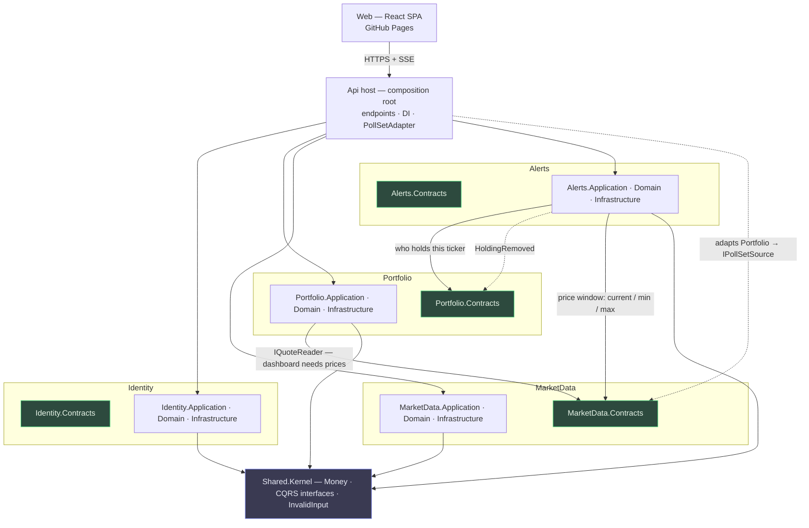
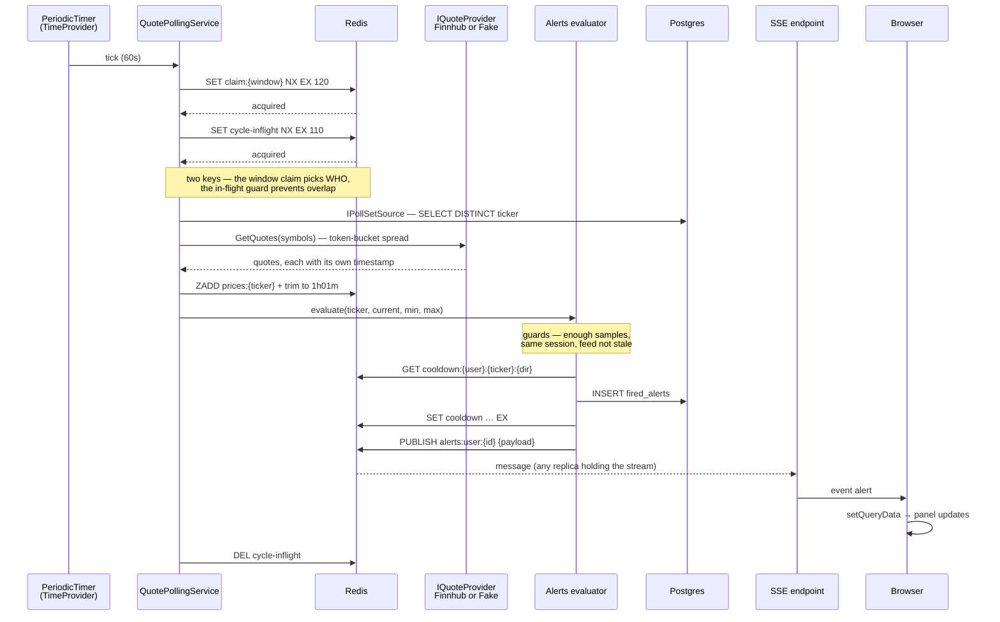
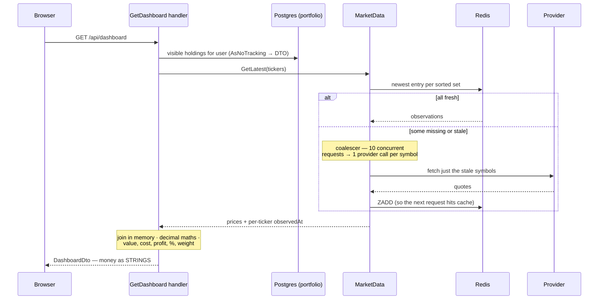
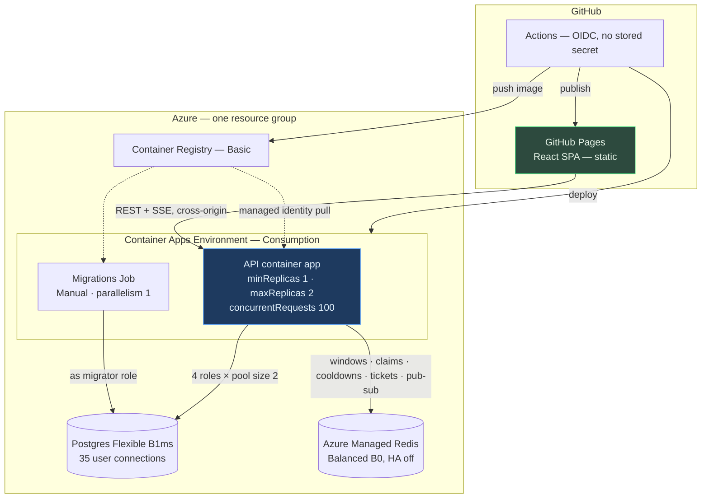

# Module interactions

Four modules in one ASP.NET Core process. A module references only other modules' `.Contracts` projects; everything else is `internal`. The compiler enforces it, and `Architecture.Tests` asserts it.

---

## 1. Dependency graph

Solid arrows are synchronous calls through a contract interface; the dotted one is a domain event.

The graph is a clean line: **Alerts → Portfolio → MarketData**, with Identity off to the side.

**MarketData depends on nothing.** It needs to know which tickers to poll, but it declares that need as its own interface — `IPollSetSource` in `MarketData.Contracts` — and the host supplies a ten-line adapter backed by `Portfolio.Contracts`. Dependency inversion, and it is what keeps the graph acyclic. Without it, MarketData reading holdings directly would make Portfolio and MarketData mutually dependent, which quietly undermines the extraction-order argument the whole shape rests on.

**Nothing points at Identity at runtime.** The JWT is self-contained, so no module calls Identity during a request. That makes it the cheapest module to extract into its own process later — a new host project, a Dockerfile, its own connection string, one swapped DI registration. MarketData is at the other end: two modules depend on it, both synchronously, so extracting *that* would put a network hop on every dashboard render.

Nothing is being extracted now. The graph is why the answer to "should auth be a service?" is a reading of the structure rather than an opinion.

`.Contracts` projects hold records of primitives only — no EF Core reference, no aggregate types, no strongly-typed IDs. A contract carrying `UserId` would drag a value converter and a persistence concern across the boundary, so contracts use raw `Guid`.

### What crosses each boundary

| From → To | Mechanism | Carries |
|---|---|---|
| Host → MarketData | `IPollSetSource` adapter | `SELECT DISTINCT ticker` across all holdings |
| Portfolio → MarketData | `IQuoteReader` | Latest price per ticker, for the dashboard join |
| Alerts → MarketData | `IPriceWindowReader` | Current / min / max over the user's window |
| Alerts → Portfolio | `IHoldersOfTicker` | Which users hold a ticker, for evaluation |
| Portfolio → Alerts | `HoldingRemoved` event | Clears any pending cooldown for that user + ticker |
| Anything → Identity | **Nothing at runtime** | The token already carries what anyone needs |

---

## 2. Runtime — the poll cycle and an alert

The alert row is written before it is published, so a publish that fails leaves a record rather than nothing. But there is **no cursor and no replay** — an alert fired while nobody is connected is simply not pushed. It shows up next time the panel loads its history, because that is a plain `GET`, not a protocol feature.

Cooldown lives in Redis with a TTL. Expiry is the whole semantics of a cooldown, so a store with native expiry is the right one; a table would need a cleanup job to do the same thing worse.

---

## 3. Runtime — dashboard with read-through

Read-through is why the poller is an **optimisation** rather than the only path to a price. It covers a blank dashboard outside market hours and a just-added ticker that the poller has not reached yet — and, now that the poll set is read live from Portfolio each cycle, there is no cached ticker table left to drift out of sync.

Money is serialised as strings. `System.Text.Json` writes `decimal` as a JSON number and `JSON.parse` makes it a double, so server-side `decimal` maths is destroyed at the boundary otherwise. Weight is computed server-side for the same reason.

---

## 4. Deployment topology

Three consequences that shape the code, all designed for from Phase 1.

Cross-origin is permanent, so `ingress.corsPolicy` lists the Pages origin explicitly. The SSE ticket handshake is mandatory — `EventSource` cannot set headers, and cross-origin cookies are unreliable now that third-party cookies are being phased out, so `POST /api/alerts/stream-ticket` returns a single-use 30-second token consumed as a query param. And a 20-second heartbeat is not optional: ACA's `requestIdleTimeout` is 4 minutes, and 4 is both the default *and* the floor on Consumption, since raising it needs a Dedicated D4+ profile with two nodes that costs more than the rest of the stack.

`minReplicas: 1` is load-bearing — scale to zero and ingestion stops. `maxReplicas: 2` is what the Postgres connection budget allows.

Locally, `docker compose up` runs the same API plus an nginx frontend container, Postgres and Redis. The brief requires the whole stack in one command, so the frontend container stays even though production serves it from Pages.
