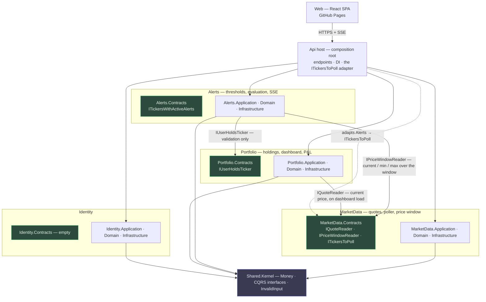
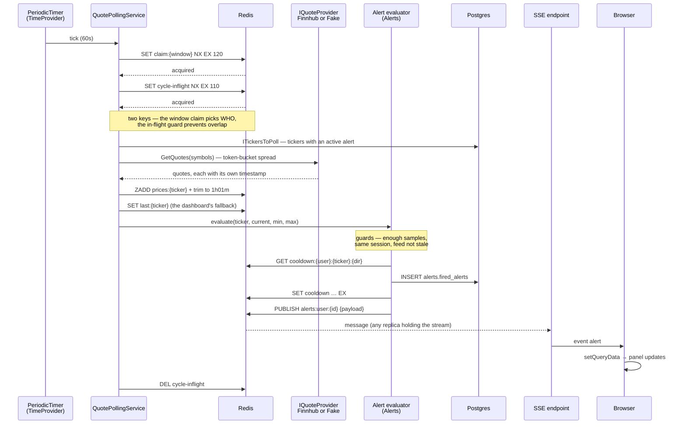
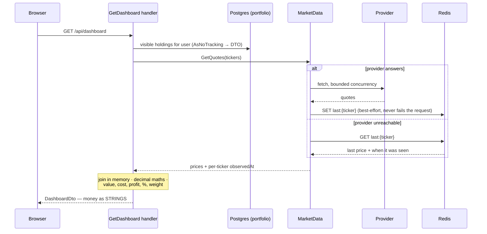

# Module interactions

Four modules in one ASP.NET Core process. A module references only other modules' `.Contracts` projects; everything else is `internal`. The compiler enforces it, and `Architecture.Tests` asserts it.

> **Reversal, twice.** Phase 2 merged Alerts into Portfolio and removed both edges to it; that was reversed
> and Alerts is a module again — the criterion is in [module-boundaries.md](module-boundaries.md).
> Separately, the **quote poller moved from Phase 3 to Phase 4**: the dashboard asks the provider directly
> and never needed a cache, so the poller now exists only to build the price history alerts evaluate
> against, and it polls only tickers with an active alert. Two consequences below the fold: the poller's
> ticker list comes from **Alerts**, not Portfolio, and the dashboard sequence no longer has a read-through
> branch.

---

## 1. Dependency graph

Every arrow is a synchronous call through a contract interface. **There are no domain events** — the only
one the project ever had existed to clear a Redis cooldown across the Portfolio/Alerts line, and a cooldown
expires by itself.

**Nothing depends on Alerts.** It is a leaf: it reads price windows from MarketData and asks Portfolio one
boolean. The host reads its ticker list to feed the poller, which is an adapter the host owns, not an
inbound dependency.

**MarketData depends on nothing.** It declares `ITickersToPoll` as its own need and the host adapts
`Alerts.Contracts` to it. The names differ on purpose — MarketData asks *what should I poll*, Alerts answers
*these have active alerts* — and if the answer ever needs to come from somewhere else, only the adapter
changes.

**Nothing calls Identity at runtime.** The JWT is self-contained, so `Identity.Contracts` is empty and that
emptiness is the evidence. It is the cheapest module to extract; MarketData is the dearest, because
Portfolio calls it on every dashboard render.

`.Contracts` projects hold records of primitives only — no EF Core reference, no aggregate types, no
strongly-typed IDs. A contract carrying `UserId` would drag a value converter and a persistence concern
across the boundary, so contracts use raw `Guid`.

### What crosses each boundary

| From → To | Mechanism | Carries |
|---|---|---|
| Host → MarketData | `ITickersToPoll` adapter over `Alerts.Contracts` | the distinct tickers with an active alert |
| Portfolio → MarketData | `IQuoteReader` | current price per ticker, fetched on dashboard load |
| Alerts → MarketData | `IPriceWindowReader` | current / min / max over the user's window |
| Alerts → Portfolio | `IUserHoldsTicker` | one boolean, so a subscription for an unheld ticker is rejected |
| Anything → Identity | **nothing at runtime** | the token already carries what anyone needs |

The poller's ticker list used to come from Portfolio — every ticker anyone held. It comes from Alerts now,
because polling exists to build alert history and a ticker nobody has an alert on needs none. With no alerts
configured anywhere, the list is empty and nothing polls.

---

## 2. Runtime — the poll cycle and an alert

The alert row is written before it is published, so a publish that fails leaves a record rather than nothing. But there is **no cursor and no replay** — an alert fired while nobody is connected is simply not pushed. It shows up next time the panel loads its history, because that is a plain `GET`, not a protocol feature.

Cooldown lives in Redis with a TTL. Expiry is the whole semantics of a cooldown, so a store with native expiry is the right one; a table would need a cleanup job to do the same thing worse.

---

## 3. Runtime — dashboard, and what happens when the provider is down

**The provider is asked first, always.** Redis is only read when that fails, which is what makes this a
fallback rather than a cache — read-through would check Redis first and fetch on a miss. A ticker added
seconds ago is therefore priced on its first render with no special case, and the poller is not involved in
this diagram at all: it may not even be running, since it polls only tickers with an active alert.

Money is serialised as strings. `System.Text.Json` writes `decimal` as a JSON number and `JSON.parse` makes it a double, so server-side `decimal` maths is destroyed at the boundary otherwise. Weight is computed server-side for the same reason.

---

## 4. Deployment topology

Three consequences that shape the code, all designed for from Phase 1.

Cross-origin is permanent, so `ingress.corsPolicy` lists the Pages origin explicitly. The SSE ticket handshake is mandatory — `EventSource` cannot set headers, and cross-origin cookies are unreliable now that third-party cookies are being phased out, so `POST /api/alerts/stream-ticket` returns a single-use 30-second token consumed as a query param. And a 20-second heartbeat is not optional: ACA's `requestIdleTimeout` is 4 minutes, and 4 is both the default *and* the floor on Consumption, since raising it needs a Dedicated D4+ profile with two nodes that costs more than the rest of the stack.

`minReplicas: 1` is load-bearing — scale to zero and ingestion stops. `maxReplicas: 2` is what the Postgres connection budget allows.

Locally, `docker compose up` runs the same API plus an nginx frontend container, Postgres and Redis. The brief requires the whole stack in one command, so the frontend container stays even though production serves it from Pages.
