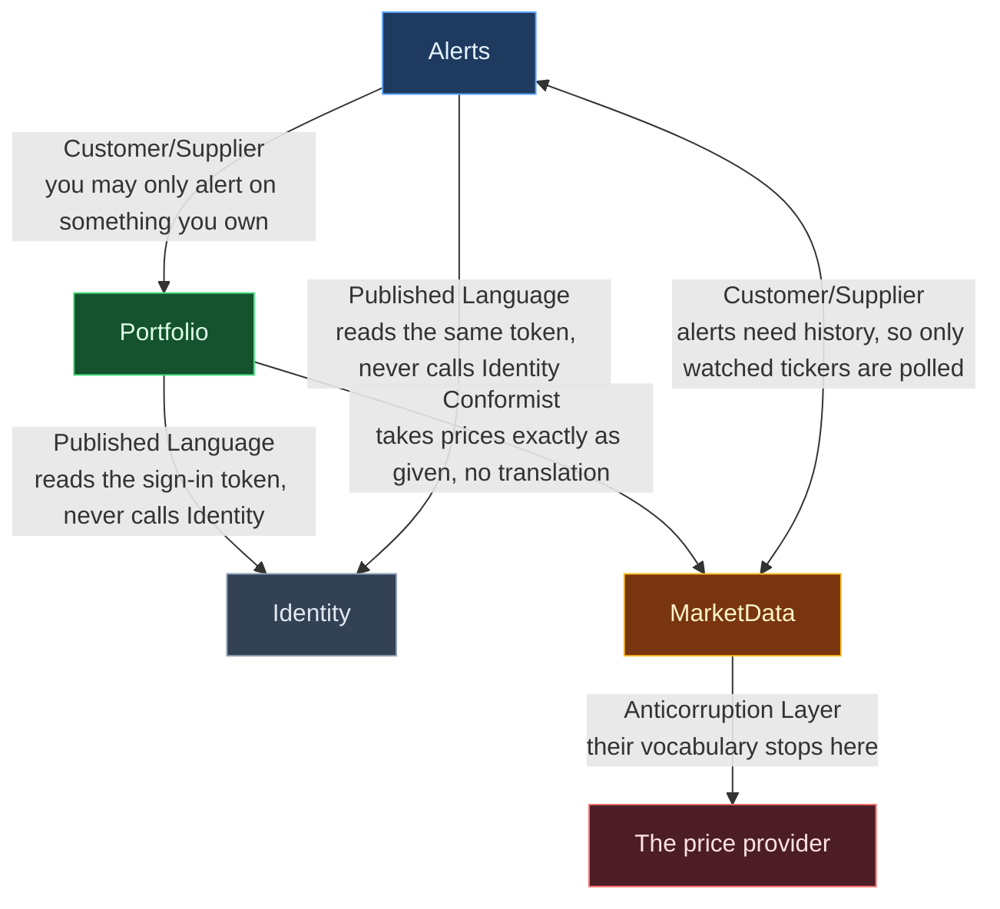

# Bounded contexts — the context map

Where each seam is placed and why is argued in [module-boundaries.md](module-boundaries.md), and that file
wins on disagreements about *where* a line goes. This file says what *kind* of relationship each line is.
Alerts is modelled, not built.

Arrows point **downstream to upstream**: the tail breaks when the head changes. All four contexts share a
small kernel — money, a validation-failure shape, and the command and query shapes — left off the map
because four more lines into one box made it unreadable. Neither the SPA nor the API host is a context;
neither holds a model.

## The Identity edges have three actors, not two

Identity *issues* the token at sign-in. The **host** opens it — the token is sealed by the application's
data-protection key ring rather than signed, so there is no signature, issuer or audience to check, only the
seal and the expiry — and hands each request an already-unpacked identity. Portfolio then reads one field
out of that; it never opens or checks anything.

So Identity and Portfolio never speak to each other. They only agree on what the token contains, and the
host is the machinery in between. That agreement is the published language, and it is why Identity publishes
no types at all.

## The contexts

| Context | What it models | The sharpest distinction in its language |
|---|---|---|
| **Identity** | a user, a refresh token | **Revoking and rotating are different endings.** Both retire a token; only rotation names a successor |
| **Portfolio** | a holding, a ticker, an amount of money | **Buying more averages; correcting replaces.** "I bought more" is not "I typed it wrong" |
| **MarketData** | a price observation, a ticker | **Observed-at is when *this app* saw the price**, never the provider's own trade time |
| **Alerts** | an alert setting, a fired alert, a direction | The threshold is measured against **your own window**, never the provider's "change today" — and only when the window's two measurements agree in sign |

## The relationships

| Edge | Pattern | Why it is that pattern | State |
|---|---|---|---|
| Portfolio → MarketData | **Conformist** | a price arrives at the profit-and-loss arithmetic unchanged; no translation layer exists | built |
| MarketData → the provider | **Anticorruption Layer** | the provider's response shapes are private to the module and are translated once, at the edge | built |
| Portfolio → Identity | **Published Language** | the user's identity arrives as a plain identifier from the token; there is no call | built |
| everything → the kernel | **Shared Kernel** | money, a validation-failure shape, the command and query shapes — and deliberately *not* the ticker | built |
| Alerts → Portfolio | Customer/Supplier | one yes-or-no question, shaped for Alerts' need | built |
| Alerts → MarketData | Customer/Supplier | price history exists because alerts need it | built |
| MarketData → Alerts | Anticorruption Layer, owned by the host | MarketData states two needs of its own — which tickers to sample, and where a sample goes; the host adapts Alerts to both | built |
| Alerts → Identity | **Published Language** | the same token claim, the same plain identifier | built |

**The bold patterns are structural** — you can check them by reading the code. Is there a translation layer?
Is the published surface empty? Is the shared subset small? **Customer/Supplier is not structural.** It is
defined by one team's priorities feeding into another team's planning, and this repository has one
developer. Those rows record intent, not an observable fact.

---

**Every context here is built.** Alerts arrived with [Phase 4](../plan/phase-4-alerts.md), which is where a change to its model belongs.
