# Data model

Four Postgres schemas, one per module, and **all four hold tables**. MarketData was the exception through
Phase 4 — everything it stored was one value per ticker in Redis — and per-user provider keys ended that.

Prices are still not in Postgres. They are derived and can be fetched again, which is what licenses a
different store for them (§3).

## The rule that shapes the diagram

**There are no foreign keys across schemas.** Each module connects as its own database role with no access
to the others, so a holding's `user_id` *cannot* be a real foreign key to the users table — the constraint
would fail to be created, and the query validating it would fail with a permission error.

So the diagram uses two line styles: **solid** for a real foreign key that Postgres enforces inside one
schema, **dashed** for a logical reference across a module boundary that only the application enforces. That
distinction is the module boundary made visible. If you find yourself wanting a solid line across schemas,
the design has drifted.

---

## Schema

```mermaid
erDiagram
    identity_AspNetUsers {
        uuid Id PK
        varchar UserName "the email address; this app has no separate username"
        varchar NormalizedUserName UK "upper-cased, and the unique index is on this"
        varchar Email
        varchar NormalizedEmail "indexed, not unique - uniqueness rides on the username"
        bool EmailConfirmed
        text PasswordHash "the framework's hasher, self-describing format"
        text SecurityStamp "rolling this is the only revocation there is"
        text ConcurrencyStamp
        text PhoneNumber
        bool PhoneNumberConfirmed
        bool TwoFactorEnabled
        timestamptz LockoutEnd
        bool LockoutEnabled
        int AccessFailedCount "lockout on repeated failures is on"
    }

    identity_AspNetUserClaims {
        int Id PK "database-generated"
        uuid UserId FK
        text ClaimType
        text ClaimValue
    }

    identity_AspNetUserLogins {
        text LoginProvider PK
        text ProviderKey PK
        text ProviderDisplayName
        uuid UserId FK
    }

    identity_AspNetUserTokens {
        uuid UserId PK,FK
        text LoginProvider PK
        text Name PK
        text Value
    }

    identity_user_preferences {
        uuid user_id PK,FK "one row per user - the user id IS the key"
        varchar theme "the enum name as written: Light | Dark | System"
        varchar language "English | Ukrainian"
    }

    portfolio_holdings {
        uuid id PK
        uuid user_id "logical reference to a user"
        varchar ticker "uppercase, one to five letters"
        numeric quantity "fractional shares allowed"
        numeric avg_price_amount "the weighted average paid"
        char avg_price_currency "one currency per position"
        bool is_visible "show or hide this position on the dashboard; defaults to true"
        timestamptz created_at
        timestamptz updated_at
    }

    portfolio_dashboard_settings {
        uuid user_id PK "logical reference, and the key"
        int refresh_interval_seconds "how often the BROWSER refetches, nothing server-side"
    }

    marketdata_user_provider_keys {
        uuid user_id PK "logical reference, and the key"
        text ciphertext "encrypted at rest, never returned to the browser"
        varchar last_four "the only part ever shown"
        timestamptz saved_at "checked against the provider when saved"
        timestamptz last_rejected_at "null until the provider refuses it"
    }

    marketdata_data_protection_keys {
        uuid id PK
        text friendly_name
        text xml "persist it, or every sealed value is unreadable after a redeploy"
    }

    alerts_alert_settings {
        uuid id PK
        uuid user_id "logical reference - Alerts owns this row, not Identity"
        varchar ticker "one threshold per position, not per account"
        bool enabled
        numeric threshold_percent
        int window_minutes "must be shorter than how long history is kept"
    }

    alerts_fired_alerts {
        uuid id PK
        uuid user_id "logical reference"
        varchar ticker
        varchar direction "the enum name as written: Fall | Rise"
        numeric change_percent "the move against the window extreme, signed"
        numeric endpoint_percent "the move end to end, signed - both must agree in sign to fire"
        numeric trigger_price_amount "the price that fired it"
        char trigger_price_currency
        numeric reference_price_amount "the window extreme it was measured against"
        char reference_price_currency
        timestamptz fired_at
        bool is_simulated "fired by the manual test button"
    }

    identity_AspNetUsers ||--o{ identity_AspNetUserClaims : "owns"
    identity_AspNetUsers ||--o{ identity_AspNetUserLogins : "owns"
    identity_AspNetUsers ||--o{ identity_AspNetUserTokens : "owns"
    identity_AspNetUsers ||--o| identity_user_preferences : "has"

    identity_AspNetUsers ||..o{ portfolio_holdings : "no foreign key"
    identity_AspNetUsers ||..o| portfolio_dashboard_settings : "no foreign key"
    identity_AspNetUsers ||..o| marketdata_user_provider_keys : "no foreign key"
    identity_AspNetUsers ||..o{ alerts_alert_settings : "no foreign key"
    identity_AspNetUsers ||..o{ alerts_fired_alerts : "no foreign key"
```



**Eleven tables are drawn and all eleven exist.** Five in `identity`, two each in `portfolio`, `marketdata`
and `alerts`.

**All four schemas have their own migration history**, and `MigrationTests` reads the bookkeeping table out
of each one by name, so a fifth appearing is a deliberate act rather than a drift.

### Identity runs on the framework's own tables, and four of the five are not ours

`AspNetUsers`, `AspNetUserClaims`, `AspNetUserLogins` and `AspNetUserTokens` are ASP.NET Core Identity's
schema, mapped by `IdentityUserContext` and only re-homed into the `identity` schema. Their names keep the
framework's casing because nothing renames them, and that is the honest signal that they are not this
project's design. **`user_preferences` is the only Identity table this project wrote**, and it is named
in this repository's style.

**There are no role tables.** The context derives from `IdentityUserContext`, not `IdentityDbContext`, so
`AspNetRoles`, `AspNetUserRoles` and `AspNetRoleClaims` are never created. Nothing in the application
authorises on a role.

**There is no table behind a session.** A refresh token is sealed and self-contained — the framework
encrypts it with the data-protection key ring and unseals it again — so there is nothing to write down and
nothing to delete. Signing out rolls `SecurityStamp`, which every refresh checks, and that is the only
revocation the framework offers. An access token already handed out cannot be retired at all; it expires.

### Where the sealing keys live, and why it is not in `identity`

`data_protection_keys` sits in the **`marketdata`** schema, not in `identity`. That looks backwards until
you follow who asked for it: bring-your-own-key needed a user's provider key encrypted at rest, so MarketData
declared two ports of its own — one to seal a value, one to store the key ring — and the host implemented
them, because `.Infrastructure` may not reference ASP.NET Core and the Data Protection packages pull it in.
The table went where the module that needed it keeps its rows.

The consequence is worth stating plainly: **that one key ring seals every session token as well**, because
the host registers a single application-wide data-protection setup. Lose the `marketdata` schema and
everyone is signed out and every stored provider key is rubbish.

### Three tables from an earlier draft that are gone

**`users` and `refresh_tokens` in Identity.** Hand-written tables with a hand-written Argon2id hasher, an
opaque refresh token hashed into a row, and rotation bookkeeping — superseded-at, superseded-by, a grace
window. All of it was replaced by ASP.NET Core Identity. The initial Identity migration drops both by name,
guarded, because a database deployed before the change still has them.

**A ticker table in MarketData.** An early design gave MarketData its own list of distinct tickers, kept in
step by subscribing to holding changes. Once the poll list is read live at the start of each cycle, that
table is duplicated state with no job — and it was the sole reason for the event subscription, a periodic
reconciliation pass, and a failure mode where one lost message diverges the two copies permanently. All
three went with it.

**A cooldown table in Alerts.** Moved to Redis with an expiry. Expiry is the entire meaning of a cooldown,
so a store with native expiry is the right one; a table needs a cleanup job to do the same thing worse.

---

## Indexes that carry weight

`portfolio.holdings` has a unique index on user and ticker. That is the merge rule's only real guarantee,
because reading a row and then inserting it in application code is a race.

There is deliberately **no retry that catches the conflict and re-routes to the merge path.** A failed save
leaves the entity still pending, so a naive retry re-sends the identical insert and never terminates unless
it also detaches and re-reads. Expressing the whole merge as a single upsert would need raw SQL, which is
banned repository-wide. So the index stays, because it is what keeps the data correct; the losing request of
two simultaneous ones surfaces as a server error rather than a conflict; the window is a millisecond wide;
and what is tested is that exactly one row survives two parallel posts.

**Identity's indexes are the framework's, and the uniqueness is not where you would look for it.**
`UserNameIndex` on the normalised username is the unique one; `EmailIndex` on the normalised email is **not
unique**. Registration is still safe from duplicates, because this application sets the username to the
email address, so the unique index covers it — but a reader who checks the email index and concludes the
address is unique has read the wrong index. Duplicate registration is caught before the insert anyway:
the handler looks the address up and returns a 409.

`alerts.fired_alerts` has an index on user ascending and fired-at descending. The history endpoint is the
only thing that reads it, and it reads it exactly one way.

`alerts.alert_settings` has a unique index on user and ticker. That is what makes "one threshold per
position" true rather than intended, and it is what turns saving the same threshold twice into an update
instead of a second row.

The three tables keyed on `user_id` alone — `user_preferences`, `dashboard_settings`, `user_provider_keys` —
need no unique index. One row per user is the primary key itself.

---

## Migration history — the trap

Each module's migration bookkeeping must be told to live in that module's own schema. The setting that moves
everything *else* into a schema does not move the bookkeeping table, which is a long-standing framework
issue that will not be fixed. Miss it and every module shares one bookkeeping table, each sees the others'
migration entries in its applied list, and updates report migrations as applied-but-missing. It looks like
data corruption.

**The rule applies to all four modules, MarketData included.** It stopped being an exception when it gained
a database. The call appears **eight** times — four modules × (module registration, design-time factory) —
and getting it right by copying carefully is not the same as it being enforced; see C6 in
[deferred-work.md](../deferred-work.md).

---

## Roles and grants

```
migrator          owns all four schemas and may create — used only by the migration job
identity_svc      read and write inside identity   only
portfolio_svc     read and write inside portfolio  only
marketdata_svc    read and write inside marketdata only
alerts_svc        read and write inside alerts     only
```

Every other pairing is revoked, so a cross-schema query fails at runtime, in CI, on the first test run. An
integration test asserts exactly that by connecting as one role and reading another's schema.

**Connection budget.** The database tier allows 35 user connections, and every connection string caps its
pool at two. What opens a pool is a **registered database context, not a database role** — the roles above
outnumber them. Four contexts are registered, the API runs at most two copies, and the pool cap is two, so
4 × 2 × 2 = **16** connections is the ceiling, leaving 19 spare. The client library's default pool size of
one hundred would ask for eight hundred. Connection pooling in front of the database is unavailable on this
tier, so there is no escape hatch below this. The migration job runs separately and not alongside the API.

The arithmetic moves whenever a context is added and **has been published wrong in this file before**, so
count `AddDbContext` calls rather than reciting the figure. It was 8 through Phase 3 with Identity and
Portfolio, 12 when Alerts landed, and 16 since Phase 5 gave MarketData one.

---

## 3. What lives in Redis instead

Prices are derived and can be fetched again, so losing them costs alert history until the series refills and
costs the dashboard its fallback until the next successful fetch — not accounts, not holdings, not money.
That risk profile is what licenses a different store.

| Key | Type | Contents | Lifetime |
|---|---|---|---|
| `marketdata:last:{ticker}` | string | the last price any path fetched, with the time it was seen | **never trimmed** — the dashboard's only fallback when the provider is unreachable |
| `marketdata:name:{ticker}` | string | the company name, learned whenever a search returns one | expires after a week, so a company that renames itself corrects without anyone acting |
| `marketdata:prices:{ticker}` | sorted set | recent observations, scored by time | trimmed on write to a little over an hour; written only for tickers with an active alert |
| `marketdata:claim:{cycle}` | string | decides *who* polls this cycle | expires shortly after the cycle |
| `marketdata:cycle-inflight` | string | decides *whether* any cycle is running | expires, and is deleted when the cycle ends |
| `marketdata:poll:last` | string | the last finished cycle — when, how many tickers it aimed at, how many it stored | overwritten each cycle, never expires |
| `alerts:cooldown:{user}:{ticker}:{direction}` | string | present means suppressed | expires after the user's cooldown |
| `stockportfolio:signalr:*` | channels | fired alerts, fanned out to whichever copy holds the browser's connection. Written and read by the real-time library, not by this application | — |

**Eight rows, and every one of them exists.** The first two shipped with the dashboard, the next four with
alerting and its poller, and the heartbeat with Phase 6.

**The heartbeat is one key for the whole deployment, not one per ticker**, and it is the entire input to the
feed health check. That is why a cache outage takes the feed's health report down with it: the poll lease
lives in Redis too, so no lease means no cycle, which means no heartbeat, which reads exactly like a poller
that has stopped. Both writes and reads swallow their failures and log — a cycle that succeeded must not be
failed by a heartbeat Redis would not take.

Each observation in the price series is stored as time-and-price together, not price alone. Members of a
sorted set must be unique, so a bare price would mean a ticker hitting the same value twice updates the
existing entry's timestamp instead of adding a second reading — silently erasing the earlier one. That
erasure is invisible to any assertion about prices or ordering; only counting the members catches it.

**The claim key is named after the poll cycle, not after the clock.** It was first named by the calendar
minute, which is only equivalent while the interval happens to be a minute: the key's lifetime is a multiple
of the poll interval, so at a shorter interval the claim expires inside the minute it names and a second copy
claims that same minute again.

**The two price structures are separate on purpose, and it is not redundancy.** The first answers *what is
it worth*; the second answers *how has it moved*. Their lifetimes differ: one is kept for as long as someone
might look, the other is trimmed to an hour and exists only while an alert does. Turn alerts off for a
ticker and it has no series at all, which is exactly when the dashboard still needs a fallback. Collapsing
them would also tie how far back the dashboard can degrade to the alert retention setting.

**The two poll locks are separate on purpose.** The cycle claim guarantees one winner *within* a cycle and
says nothing *across* cycles, so a cycle that overruns is still fetching when the next one opens and a
different copy claims it. The in-flight guard closes that gap. Acquire the claim first and release only what
was actually acquired — releasing after a refused claim deletes the winner's in-flight key and re-opens the
overlap.
