# Data model

Four Postgres schemas, one per module — with **one deliberate exception**. MarketData keeps no database at
all: everything it stores is one value per ticker in Redis (§3). Its schema and database role exist and are
inert; they become real only when per-user provider keys arrive.

Price observations are not in Postgres either, for the same reason — they are derived and can be fetched
again.

## The rule that shapes the diagram

**There are no foreign keys across schemas.** Each module connects as its own database role with no access
to the others, so a holding's `user_id` *cannot* be a real foreign key to `identity.users` — the constraint
would fail to be created, and the query validating it would fail with a permission error.

So the diagram uses two line styles: **solid** for a real foreign key that Postgres enforces inside one
schema, **dashed** for a logical reference across a module boundary that only the application enforces. That
distinction is the module boundary made visible. If you find yourself wanting a solid line across schemas,
the design has drifted.

---

## Schema

```mermaid
erDiagram
    identity_users {
        uuid id PK "time-ordered, generated in the domain"
        text email UK "lowercased on creation"
        text password_hash "slow hash, self-describing format"
        timestamptz created_at
    }

    identity_refresh_tokens {
        uuid id PK
        uuid user_id FK
        bytea token_hash UK "hash of the opaque token, never the token"
        timestamptz expires_at
        timestamptz created_at
        timestamptz superseded_at "null while active"
        uuid superseded_by "set by rotation only, not by sign-out"
    }

    identity_user_preferences {
        uuid id PK
        uuid user_id FK,UK "one row per user"
        text theme "light | dark | system"
        text language "English | Ukrainian"
    }

    identity_data_protection_keys {
        int id PK
        text friendly_name
        xml key_data "persist it, or encrypted user data is orphaned on redeploy"
    }

    portfolio_holdings {
        uuid id PK
        uuid user_id "logical reference to a user"
        text ticker "uppercase, one to five letters"
        numeric quantity "fractional shares allowed"
        numeric avg_price_amount "the weighted average paid"
        char avg_price_currency "one currency per position"
        boolean is_visible "show or hide this position on the dashboard"
        timestamptz created_at
        timestamptz updated_at
    }

    portfolio_dashboard_settings {
        uuid id PK
        uuid user_id UK "logical reference"
        int refresh_interval_seconds "how often the BROWSER refetches, nothing server-side"
    }

    marketdata_user_api_keys {
        uuid id PK
        uuid user_id UK "logical reference"
        bytea encrypted_key "encrypted at rest, never returned to the browser"
        char last_four "the only part ever shown"
        timestamptz validated_at "checked against the provider when saved"
    }

    alerts_alert_settings {
        uuid id PK
        uuid user_id "logical reference — Alerts owns this row, not Identity"
        text ticker "one threshold per position, not per account"
        boolean enabled
        numeric threshold_percent
        int window_minutes "must be shorter than how long history is kept"
    }

    alerts_fired_alerts {
        uuid id PK
        uuid user_id "logical reference"
        text ticker
        text direction "fall | rise"
        numeric change_percent "the move against the window extreme, signed"
        numeric endpoint_percent "the move end to end, signed - both must agree in sign to fire"
        numeric trigger_price_amount "the price that fired it"
        char trigger_price_currency
        numeric reference_price_amount "the window extreme it was measured against"
        char reference_price_currency
        timestamptz fired_at
        boolean is_simulated "fired by the manual test button"
    }

    identity_users ||--o{ identity_refresh_tokens : "owns"
    identity_users ||--o| identity_user_preferences : "has"

    identity_users ||..o{ portfolio_holdings : "no foreign key"
    identity_users ||..o| portfolio_dashboard_settings : "no foreign key"
    identity_users ||..o| marketdata_user_api_keys : "no foreign key"
    identity_users ||..o{ alerts_alert_settings : "no foreign key"
    identity_users ||..o{ alerts_fired_alerts : "no foreign key"
```



**Eight tables plus the key ring are drawn. Five of them exist.**

| Built today | Arrives with settings and per-user keys |
|---|---|
| `identity.users`, `identity.refresh_tokens`, `portfolio.holdings`, `alerts.alert_settings`, `alerts.fired_alerts` | `identity.user_preferences`, `identity.data_protection_keys`, `portfolio.dashboard_settings`, `marketdata.user_api_keys` |

Three schemas have migration history, and a test pins that list — so a fourth appearing is a deliberate act,
not a drift.

### Two tables from an earlier draft that are gone

**A ticker table in MarketData.** An early design gave MarketData its own list of distinct tickers, kept in
step by subscribing to holding changes. Once the poll list is read live at the start of each cycle, that
table is duplicated state with no job — and it was the sole reason for the event subscription, a periodic
reconciliation pass, and a failure mode where one lost message diverges the two copies permanently. All
three went with it.

**A cooldown table in Alerts.** Moved to Redis with an expiry. Expiry is the entire meaning of a cooldown,
so a store with native expiry is the right one; a table needs a cleanup job to do the same thing worse.

---

## Indexes that carry weight

`portfolio.holdings` needs a unique index on user and ticker. That is the merge rule's only real guarantee,
because reading a row and then inserting it in application code is a race.

There is deliberately **no retry that catches the conflict and re-routes to the merge path.** A failed save
leaves the entity still pending, so a naive retry re-sends the identical insert and never terminates unless
it also detaches and re-reads. Expressing the whole merge as a single upsert would need raw SQL, which is
banned repository-wide. So the index stays, because it is what keeps the data correct; the losing request of
two simultaneous ones surfaces as a server error rather than a conflict; the window is a millisecond wide;
and what is tested is that exactly one row survives two parallel posts. Registration's duplicate-email race
is the same decision.

`identity.users` needs a unique index on email, for registration conflict detection.
`identity.refresh_tokens` needs a unique index on the token hash, plus a partial index on the active ones so
rotation lookups never touch retired tokens.

`alerts.fired_alerts` needs an index on user and fired-at descending. The history endpoint is the only thing
that reads it, and it reads it exactly one way.

`alerts.alert_settings` needs a unique index on user and ticker. That is what makes "one threshold per
position" true rather than intended, and it is what turns saving the same threshold twice into an update
instead of a second row.

---

## Migration history — the trap

Each module's migration bookkeeping must be told to live in that module's own schema. The setting that moves
everything *else* into a schema does not move the bookkeeping table, which is a long-standing framework
issue that will not be fixed. Miss it and every module shares one bookkeeping table, each sees the others'
migration entries in its applied list, and updates report migrations as applied-but-missing. It looks like
data corruption.

The rule applies to every module that persists to Postgres. **MarketData is not one of them and must not be
added** — an empty database context would buy a zero-table migration, a bookkeeping row and a failing
assertion, for no behaviour at all.

---

## Roles and grants

```
migrator          owns all four schemas and may create — used only by the migration job
identity_svc      read and write inside identity   only
portfolio_svc     read and write inside portfolio  only
marketdata_svc    read and write inside marketdata only
alerts_svc        read and write inside alerts     only
```

Every other pairing is revoked, so a cross-schema query fails at runtime, in CI, on the first test run. An
integration test asserts exactly that by connecting as one role and reading another's schema.

**Connection budget.** The database tier allows 35 user connections, and every connection string caps its
pool at two. What opens a pool is a **registered database context, not a database role** — the roles above
outnumber them. Three contexts are registered, the API runs at most two copies, and the pool cap is two, so
**twelve** connections is the ceiling, leaving 23 spare. The client library's default pool size of one
hundred would ask for six hundred. Connection pooling in front of the database is unavailable on this tier,
so there is no escape hatch below this. The migration job runs separately and not alongside the API.

The arithmetic moves whenever a context is added and has been published wrong before, so count the
registrations rather than reciting the figure. It was eight through Phase 3, when only Identity and Portfolio
registered one; the alerts context is what made it twelve. MarketData still registers none.

---

## 3. What lives in Redis instead

Prices are derived and can be fetched again, so losing them costs alert history until the series refills and
costs the dashboard its fallback until the next successful fetch — not accounts, not holdings, not money.
That risk profile is what licenses a different store.

| Key | Type | Contents | Lifetime |
|---|---|---|---|
| `marketdata:last:{ticker}` | string | the last price any path fetched, with the time it was seen | **never trimmed** — the dashboard's only fallback when the provider is unreachable |
| `marketdata:name:{ticker}` | string | the company name, learned whenever a search returns one | expires after a week, so a company that renames itself corrects without anyone acting |
| `marketdata:prices:{ticker}` | sorted set | recent observations, scored by time | trimmed on write to a little over an hour; written only for tickers with an active alert |
| `marketdata:claim:{cycle}` | string | decides *who* polls this cycle | expires shortly after the cycle |
| `marketdata:cycle-inflight` | string | decides *whether* any cycle is running | expires, and is deleted when the cycle ends |
| `alerts:cooldown:{user}:{ticker}:{direction}` | string | present means suppressed | expires after the user's cooldown |
| `stockportfolio:signalr:*` | channels | fired alerts, fanned out to whichever copy holds the browser's connection. Written and read by the real-time library, not by this application | — |

**All eight exist.** The first two shipped with the dashboard; the rest arrived with alerting.

Each observation in the series is stored as time-and-price together, not price alone. Members of a sorted
set must be unique, so a bare price would mean a ticker hitting the same value twice updates the existing
entry's timestamp instead of adding a second reading — silently erasing the earlier one. That erasure is
invisible to any assertion about prices or ordering; only counting the members catches it.

**The claim key is named after the poll cycle, not after the clock.** It was first named by the calendar
minute, which is only equivalent while the interval happens to be a minute: the key's lifetime is a multiple
of the poll interval, so at a shorter interval the claim expires inside the minute it names and a second copy
claims that same minute again.

**The two price structures are separate on purpose, and it is not redundancy.** The first answers *what is
it worth*; the second answers *how has it moved*. Their lifetimes differ: one is kept for as long as someone
might look, the other is trimmed to an hour and exists only while an alert does. Turn alerts off for a
ticker and it has no series at all, which is exactly when the dashboard still needs a fallback. Collapsing
them would also tie how far back the dashboard can degrade to the alert retention setting.

**The two poll locks are separate on purpose.** The cycle claim guarantees one winner *within* a cycle and
says nothing *across* cycles, so a cycle that overruns is still fetching when the next one opens and a
different copy claims it. The in-flight guard closes that gap. Acquire the claim first and release only what
was actually acquired — releasing after a refused claim deletes the winner's in-flight key and re-opens the
overlap.

---

**Where the unbuilt parts come from.** Five tables exist, and every Redis key does. The settings tables and
the per-user key table arrive with [Phase 5](../plan/phase-5-make-it-mine.md).
