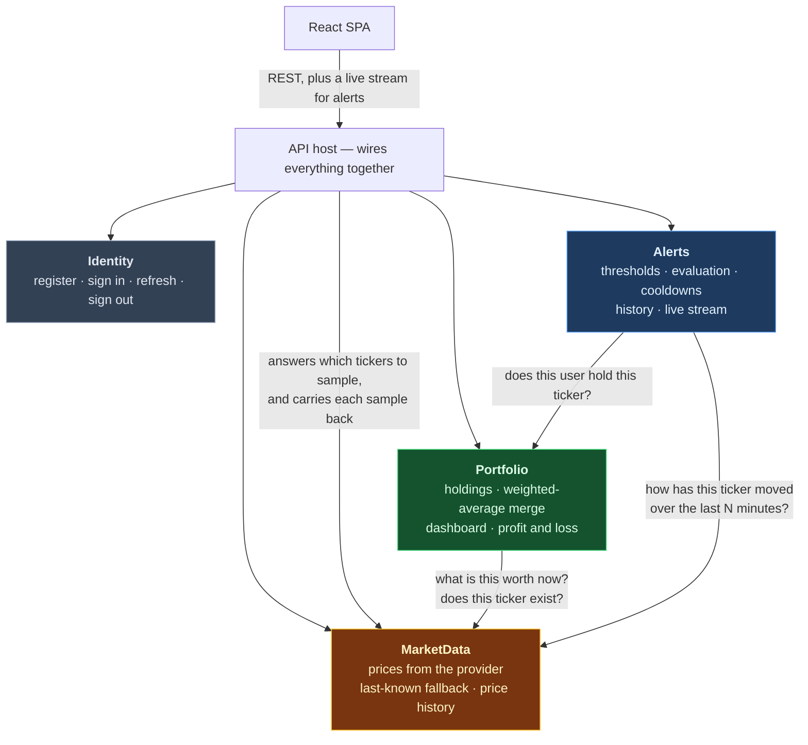
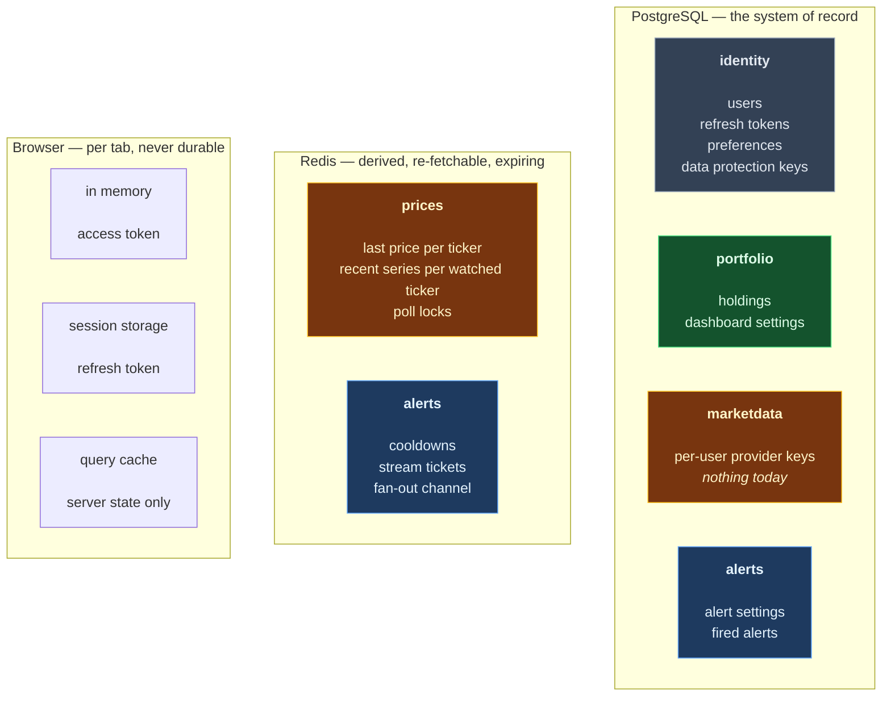

# Module boundaries

Four modules: **Identity**, **Portfolio**, **MarketData**, **Alerts**. All four exist.

This file says why the lines fall where they do, and, more usefully, the three places a line could have been
drawn and deliberately was not.

Companions: [module-interactions.md](module-interactions.md) for what flows across each line at runtime,
[er-diagram.md](er-diagram.md) for the data model, [bounded-contexts.md](bounded-contexts.md) for what kind
of relationship each line is.

---

## 1. The criterion

A modular monolith exists so that boundaries are real now and *could* become network boundaries later,
without paying distribution costs today. So the test for every seam is: **would it survive becoming a
network call?**

Four questions, all checkable:

| # | Question | The seam fails if… |
|---|---|---|
| 1 | **Shared transaction** — must anything on both sides be written together, all or nothing? | yes — two things in one transaction belong in one module |
| 2 | **Chattiness** — how many calls cross it, and can they be batched? | it is one call per row, on a hot path, with nothing to batch |
| 3 | **Independent failure** — can one side be down while the other degrades rather than breaks? | one side going down takes the other with it |
| 4 | **Single writer** — does exactly one module write each table? | two modules write the same rows |

This is used instead of labelling modules as core, supporting or generic subdomains. That vocabulary is real
design language, but applying it here changed not one line of code. The four questions above changed real
ones.

Worth keeping the words apart: a **subdomain** is a slice of the problem; a **bounded context** is a model
boundary; a **module** here is a group of projects with its own database schema. Calling one of them "the
core module" collapses three different ideas into one.

---

## 2. The four modules

Read the graph two ways and it says the same thing both times.

**Nothing depends on Alerts, and Alerts depends on two things.** It is a pure consumer — the leaf of the
graph, and therefore the module whose internals nobody else can be broken by.

**MarketData depends on nothing.** It needs to know which tickers to poll and it needs to announce each
sample it takes, but it states both needs itself and the host supplies the answers from Alerts. Without that
inversion the graph would cycle — twice, because evaluation runs in the same cycle as the fetch, so the
outbound announcement is as load-bearing as the inbound list. The two sides also ask different questions —
MarketData asks *what should I sample*, Alerts answers *these have an active alert* — and they only happen to
coincide today.

**Nothing calls Identity at runtime.** The sign-in token carries everything any other module needs, so
Identity publishes no types at all. That emptiness is the evidence.

Every arrow is an ordinary in-process call carrying plain values — identifiers, strings, numbers. There are
no domain events anywhere in the system; see §4.

---

## 3. What is in each module

### Identity — signing in

Users and refresh tokens. Passwords are stored as a slow hash; refresh tokens are stored hashed too, so the
database never holds anything that can be replayed. Sessions, rotation and the two different ways a session
ends are described in [sessions and tokens](identity-contracts.md).

Depends on nothing. Depended on by nothing at runtime. That makes it the cheapest module to extract: a new
host, its own connection string, and one swapped registration.

### Portfolio — what you own and what it is worth

One holding per user per ticker, enforced by a unique index. Quantity must be positive, price must be
positive, and a position has a single currency.

The domain language does real work in exactly one place: buying more of something you already hold
**averages** the price, while fixing a typo **replaces** it. Both touch the same two fields and mean
completely different things, and hiding them behind one flag is how a correction silently becomes a
purchase.

The dashboard is a read-only view over the same holdings — market value, cost, profit in money and percent,
weight in the portfolio, and how fresh each price is.

Depends on MarketData for two things (§4). Offers Alerts one thing: whether a given user holds a given
ticker, so an alert cannot be set on a position you do not own.

### MarketData — where prices come from

No entities to speak of. It fetches prices on demand, answers whether a ticker exists, remembers the last
price it saw for every ticker, and falls back to that remembered value — with its age — when the provider is
unreachable. With no provider key configured it serves generated prices instead, which is what lets the
whole stack start from a clean clone.

It also owns the only thing in the application that runs without a request: a poller that samples the tickers
it is told to sample and keeps a trimmed recent series for each. The list comes from outside, and so does
what happens with each sample — see §2. Whatever it fetches on that path updates the last-known price through
the **same single writer** the dashboard uses, so the real and generated provider paths cannot record
differently.

**It keeps no database.** Everything it stores is one value per ticker in Redis. A schema and a database
role exist for it and are inert; they become real when per-user provider keys arrive.

Worth being honest: MarketData has almost no domain model. Its rules are integration policy — how long
history is kept, how ticker existence is decided, when a price counts as stale, when to stop calling a
failing provider. That thinness is exactly why it is a good extraction candidate. It is a bought capability
behind a port, not a place where this product is differentiated.

Two of those policies are worth stating because both are counter-intuitive:

- **A price of zero does not mean the ticker is unknown.** The provider returns zero both for a symbol that
  does not exist and for a healthy one it briefly failed on, so reading zero as "unknown" would permanently
  reject a valid holding after one bad second. Existence is decided by a separate symbol search with an
  exact match on the symbol itself — never on "the search returned something", because the search is fuzzy
  and a prefix returns near misses.
- **The existence check fails open.** If the provider cannot answer, the ticker is treated as valid. A
  provider outage must not stop someone recording a purchase they actually made.

### Alerts — noticing a move and telling you

Per-position thresholds, a history of what fired, cooldowns so one move does not notify you nine times, a
live stream to the browser, and a button to simulate a firing.

The threshold is measured against **the extreme of your own window** — the highest and lowest price seen in
the last N minutes — never against the provider's own "change today" figure, which answers a different
question in the same units.

Measuring against the extreme alone reports a standing property of the window as if it were an event, so an
alert fires only when the extreme move and the end-to-end move **agree in sign**. That rule, and the two
alternatives it beat, are argued in [the phase plan](../plan/phase-4-alerts.md).

Depends on Portfolio (validation only) and MarketData (price history). Nothing depends on it.

---

## 4. Where a line was deliberately **not** drawn

This section is the point of the file. Splitting everything is not judgement; knowing where to stop is.

### The dashboard stays inside Portfolio

It reads the same holdings the write side owns, joined in memory with prices. Question 1 answers itself —
same rows, same writer — and question 4 says there is exactly one writer for holdings. Extracting it would
put a network hop between a query and the rows it queries, and buy nothing.

### There is no Settings module

The design has one Settings *screen*, which is a UI grouping, not a boundary. Each setting lives with the
thing it configures:

| Setting | Owner | Because |
|---|---|---|
| theme, language | Identity | properties of the person, not of any feature |
| dashboard refresh interval, which positions are shown | Portfolio | properties of the portfolio view |
| threshold percent, window minutes | Alerts | properties of the alert rule |
| the user's own provider key | MarketData | configures where prices come from |

A Settings module would own rows that four other modules read, which fails question 4 outright — four
readers, one writer, and every schema boundary punctured to reach it. The screen composes four independent
calls instead, which also means a rejected provider key cannot discard a perfectly good theme change.

### Asking for a price and checking a ticker exists stay two separate things

Both cross from Portfolio to MarketData and both are about the same provider, so merging them looks
obvious. Don't: **they degrade in opposite directions.** When the provider is unreachable, a price request
falls back to the last price seen; an existence check answers *yes*. One thing answering both questions
would have to pick a single failure policy, and either choice is wrong for one of them — either an outage
blocks people from recording purchases, or a genuinely bad ticker gets a fabricated price.

### The two stored price structures are not collapsed into one

One holds the last price seen for a ticker; the other holds a trimmed recent series for a ticker under
alert. Both are written from the same fetch, which looks like one fact stored twice.

Their **lifetimes** differ. A last-known price is wanted for as long as someone might open the dashboard and
is never trimmed. A series is trimmed to about an hour and only exists while an alert does — turn alerts off
for a ticker and it has no series at all, which is precisely when the dashboard still needs a fallback.
Collapsing them would also tie how far the dashboard can degrade to the alert retention setting, so
shortening the window would silently shorten the fallback.

Duplication is the right call when two copies have different lifecycles, and the wrong call when they share
one — which is why there is no third copy under either.

---

## 5. The reversal, and what it taught

Alerts was once merged into Portfolio, and that was undone. The record matters more than the outcome.

**The merge's argument:** a ticker means the same thing in Portfolio, in MarketData and in Alerts, so there
was no divergence in language, so it was one context split three ways.

**Why that is invalid:** divergent language is *sufficient* to conclude two contexts exist. It is not
*necessary*. Two contexts can share a vocabulary completely and still be two, because they change for
different reasons, are written on different triggers, or fail independently. A bank's statements and its
fraud detection both mean the same thing by "account", and nobody merges them.

**What the merge was reacting to, and got right:** the whole plan contained exactly one domain event, and it
existed solely so that deleting a holding could clear an alert cooldown. That single event dragged in a
publisher, an interception point, a dispatch-timing decision and a pile of tests. It was real,
disproportionate complexity.

**The fix was to delete the event, not the boundary.** A cooldown expires by itself; not clearing it costs,
at worst, one suppressed alert if the user re-buys the same ticker within the window. So the boundary came
back and the domain-event machinery stayed deleted. Alerts learns about a removed holding by simply not
finding it on the next cycle.

Against the four questions, the Portfolio/Alerts seam passes all of them: nothing on the two sides is
written in one transaction, the traffic is one lookup per ticker per cycle, alerts can be down while the
dashboard renders, and each table has one writer. Three groups of data with no rule spanning any two of them
are not one context.

**The cost of the round trip, and how it ended:** the database initialisation, compose file and
infrastructure templates were never stripped of the alerts schema and role during the merge, so for two
phases they were orphans — the right shape for a module that did not exist. That closed when the module was
built: an alerts database context now connects as the alerts role, with its own migration history table, from
a clean volume. The settings were never edited to fix this, which was the whole gamble; being the right shape
already is what made the reversal cheap.

---

## 6. Storage ownership

**One schema per module that stores anything, one database role per schema, and no foreign keys across
schema lines.** A holding's user cannot be a real foreign key to the users table, because the portfolio role
has no access to the identity schema and the constraint would fail to be created. Cross-module references
are plain identifiers, checked by the application. Wanting a real foreign key across a schema line means the
design has drifted. The isolation is asserted by a test that connects as one module's role and confirms
another module's tables are unreadable.

**What is in Redis and why it is not in Postgres:** prices are derived and can be fetched again — losing
them costs alert history until the series refills, and costs the dashboard its fallback until the next
successful fetch, not money. A cooldown *is* its expiry, so a store with native expiry is the right one; a
table would need a cleanup job to do the same thing worse. The poll locks are locks, not data.

**Money never crosses the wire as a number.** JSON numbers become floating point in the browser, which
destroys the precision computed on the server. Amounts are sent as strings, and totals, weights and profit
are all computed server-side.

**There is no cookie anywhere.** The access token lives in memory and the refresh token in session storage,
which is tab-scoped, so a shared machine does not leak a live session. A cookie the browser refuses to hand
to scripts would be stronger and is unavailable: the SPA and the API are on different origins permanently,
so it would be a third-party cookie, and some browsers block those outright.

---

## 7. Extraction order, if it ever happened

Nothing is being extracted. The order is a reading of the graph, not a plan — and being able to state it is
the point of drawing the boundaries in the first place.

| Order | Module | What it would cost |
|---|---|---|
| 1 | **Identity** | Almost nothing. Nothing calls it at runtime; the token already is the integration |
| 2 | **Alerts** | Low. It is a leaf, and it already tolerates being behind |
| 3 | **MarketData** | Moderate. Portfolio calls it on every dashboard render, and nothing absorbs the hop |
| 4 | **Portfolio** | Last, by definition — it is what would be left |

The uncomfortable one is MarketData, and it is worth saying rather than hiding. It has the least domain and
the most infrastructure, which makes it the most natural service — but it sits on the dashboard's critical
path with nothing in front of it. The dashboard asks the provider first, always, and the stored last price
is read only when that fails, so it is a fallback rather than a cache and absorbs nothing. Extraction would
put an un-absorbed network hop on the hottest path in the app.

---

**Everything here is built**, except the per-user provider keys in the marketdata schema, which arrive with [Phase 5](../plan/phase-5-make-it-mine.md). Alerts was built by [Phase 4](../plan/phase-4-alerts.md), and that file is where a change to its design belongs — change it there first, then bring this file into line.
