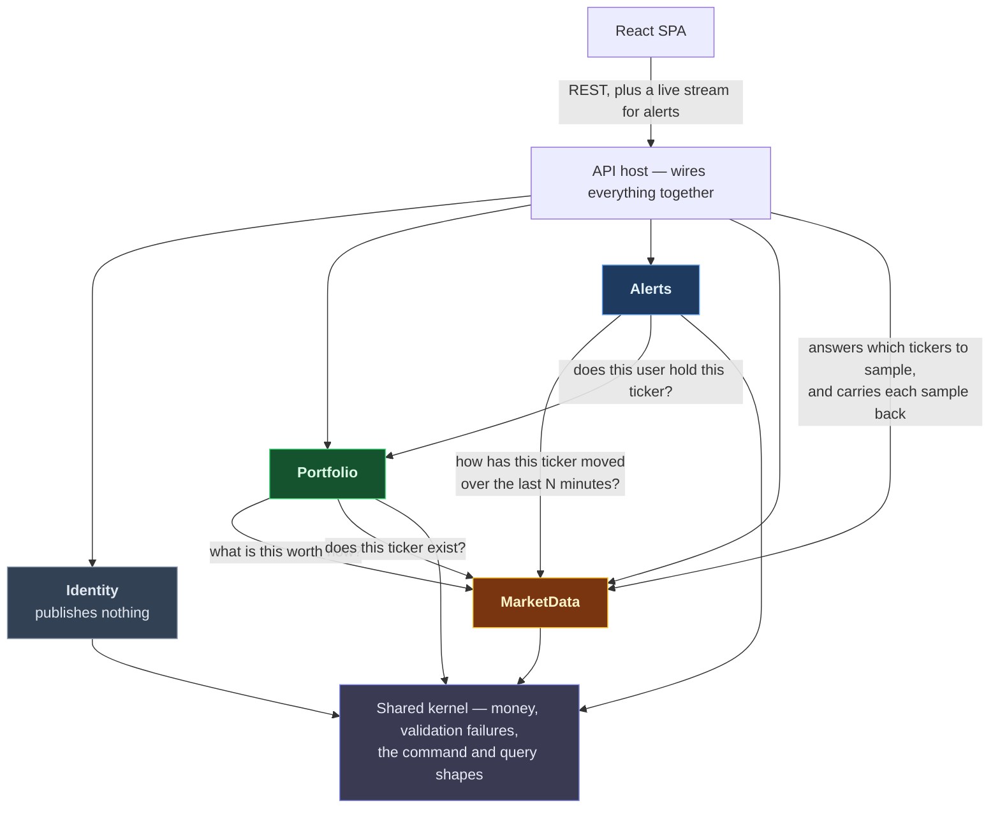
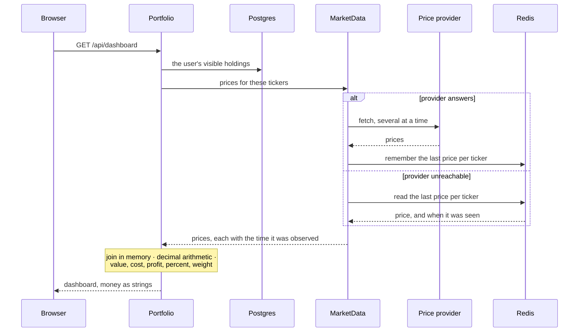
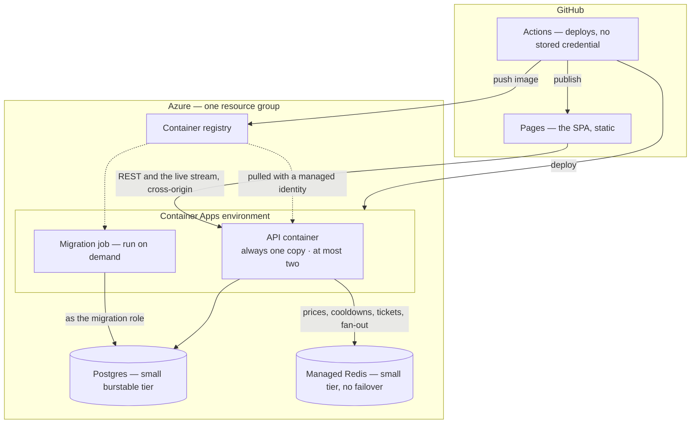

# Module interactions

Four modules in one process, **all four built**. A module may reach only the small set of types another
module publishes for that purpose, and nothing deeper.

**Nothing but a test enforces that, so the test is load-bearing.** Most of a module is publicly visible,
because a module is several assemblies and hiding things per assembly would stop it compiling. So the
compiler cannot catch a module reaching past another's published surface. A reflection test over assembly
references is the only guard. Do not weaken or skip it on the assumption that the compiler has your back.

Where seams are placed and why is in [module-boundaries.md](module-boundaries.md); what *kind* of
relationship each is, in [bounded-contexts.md](bounded-contexts.md).

---

## 1. Dependency graph



Every arrow is an ordinary in-process call. **There are no domain events** — the only one the project ever
had existed to clear an alert cooldown when a holding was deleted, and a cooldown expires by itself.

**Nothing depends on Alerts.** It reads price history and asks Portfolio one yes-or-no question. The host
reads its list of watched tickers to drive the poller and hands each fresh sample back to it for evaluation,
which is the host adapting one module to another, not an inbound dependency.

**MarketData depends on nothing.** It states **two** needs of its own — which tickers am I to sample, and
here is a sample that landed — and the host answers both from Alerts. The second is the one that is easy to
miss: evaluation runs in the same cycle as the fetch and belongs to Alerts, so without an outbound port the
poller would have to call Alerts directly, which is the one edge this graph forbids. Both are worded as
MarketData's own need rather than as "ask Alerts", so if either answer ever has to come from somewhere else,
only the host's adapter changes.

**Nothing calls Identity at runtime.** The sign-in token is self-contained, so Identity publishes no types
at all and that emptiness is the evidence. It is the cheapest module to extract; MarketData is the dearest,
because Portfolio calls it on every dashboard render.

What crosses a boundary is plain values only — identifiers as raw strings and numbers, no database types, no
wrapper types. A published type carrying a module's own identifier wrapper would drag a persistence concern
across the line with it.

### What crosses each line

Every edge is built.

| From → To | What it asks |
|---|---|
| Portfolio → MarketData | what is each of these tickers worth right now |
| Portfolio → MarketData | does this ticker actually exist |
| Portfolio → MarketData | what are these companies called |
| Alerts → Portfolio | does this user hold this ticker |
| Alerts → MarketData | current, oldest, lowest and highest price over the user's window, and the longest gap in it |
| Host → MarketData | which tickers have an active alert |
| Host → Alerts | this ticker has a fresh sample — evaluate it |
| Anything → Identity | **nothing** — the token already carries what anyone needs. Identity publishes zero types |

**Portfolio asks MarketData three questions, not one, and they are deliberately kept apart** — see
[module-boundaries.md](module-boundaries.md) §4. When the provider is unreachable, a price request falls
back to the last price seen, an existence check answers *yes*, and a name request answers *nothing known*.
Three opposite failure directions cannot share one policy — and the name request never reaches the provider
at all, so it cannot make a page wait on one.

**The poll list comes from Alerts, not Portfolio.** It once came from Portfolio — every ticker anyone held.
Polling exists to build the price history alerts are evaluated against, and a ticker nobody has an alert on
needs none. With no alerts configured anywhere, the list is empty and nothing polls.

---

## 2. Runtime — the dashboard, and what happens when the provider is down

This is the sequence that runs today.



**The provider is asked first, always.** Redis is read only when that fails, which is what makes the stored
price a fallback rather than a cache — a cache would be consulted first and the provider only on a miss. A
ticker added seconds ago is therefore priced on its first render with no special case.

The fallback is **per ticker, not per request.** If three of twenty tickers fail, seventeen good prices are
served and three fall back. Catching one failure and falling back for the whole request would throw away
seventeen prices that were already paid for, and — because those prices had just been stored — the numbers
would come back looking identical. The only visible difference is the flag saying a price is stale, which is
why it is part of the response and part of what is asserted.

Money is sent as strings. JSON numbers become floating point in the browser and the server's precision is
destroyed at the boundary. Weight and percentages are computed on the server for the same reason.

---

## 3. Runtime — the poll cycle and an alert

**This is the only thing in the system that runs without a request**, which is why the deployed API can no
longer scale to zero copies (§4).

```mermaid
sequenceDiagram
    participant T as Timer
    participant P as Poller
    participant R as Redis
    participant F as Price provider
    participant E as Alert evaluation
    participant DB as Postgres
    participant S as Live stream
    participant B as Browser

    T->>P: tick
    P->>R: claim this cycle; refuse if a cycle is still running
    Note over P,R: two locks — one picks WHO polls,<br/>the other stops cycles overlapping

    P->>DB: which tickers have an active alert
    P->>F: fetch them, spread out to respect the rate limit
    F-->>P: prices, each with its own timestamp
    P->>R: append to the recent series, trim to the retention window
    P->>R: remember the last price (the dashboard's fallback)

    P->>E: evaluate ticker against current, oldest, lowest and highest
    Note over E: guards — enough samples, no gap<br/>inside the window, feed not stale
    E->>R: is this user already in cooldown for this direction?
    E->>DB: record the fired alert
    E->>R: start the cooldown
    E->>R: publish to the user's channel

    R-->>S: whichever copy holds this user's stream
    S->>B: alert event
    B->>B: panel updates
```

The alert is recorded before it is published, so a failed publish leaves a record rather than nothing. There
is **no replay** — an alert that fires while nobody is connected is simply not pushed. It appears next time
the panel loads its history, because history is an ordinary request, not a protocol feature.

The cooldown lives in Redis with an expiry, because expiry is the entire meaning of a cooldown. It is claimed
with a single set-if-absent, never a read followed by a write: two copies of the app evaluating the same
ticker in the same millisecond would both pass a read-then-write check and send the user two alerts.

**An alert fires only when both measurements of the window agree in sign** — the move end to end and the
move against the extreme. A price that dips and recovers is up against the window low and down end to end,
and firing on the extreme alone would report that as a rise on every cycle, forever. The full argument is in
[the phase plan](../plan/phase-4-alerts.md).

---

## 4. Deployment



Three consequences shape the code, and all three were designed for from the start.

**Cross-origin is permanent**, because the SPA is on one host and the API on another. The allowed origin is
listed explicitly. The live stream cannot send an authorization header, and cross-origin cookies are
unreliable now that third-party cookies are being phased out, so the browser first exchanges its session for
a single-use, short-lived ticket and passes that on the stream URL.

**A heartbeat every twenty seconds is not optional.** The hosting platform closes an idle connection after
four minutes, and four minutes is both the default and the floor on this tier — raising it needs a
dedicated, much more expensive plan.

**The API keeps at least one copy running, and at most two.** It scaled to zero until the poller landed, and
zero was only ever correct while nothing ran between requests — a sleeping copy samples no prices, so no
alert fires and nothing reports a fault. The two are one decision. What that bought back is the cold start
the first request of a session used to pay for; what it costs is one container billed around the clock, and
a copy holding an open stream never qualifies for the reduced idle rate either. The ceiling of two is what
the database connection budget allows — see [er-diagram.md](er-diagram.md). The concurrency threshold the
platform scales on had to rise fourfold with it, because a held-open stream can count as one in-flight
request for its whole life.

Locally, one command brings up the same API plus a web server for the SPA, Postgres and Redis. The brief
requires the whole stack in one command, so the SPA container stays even though production serves it
statically.

---

**Everything on this page is built.** [Phase 4](../plan/phase-4-alerts.md) built the edges terminating in Alerts, the background poller and the live stream, and is where a change to any of them belongs — change it there first, then bring this file into line.
