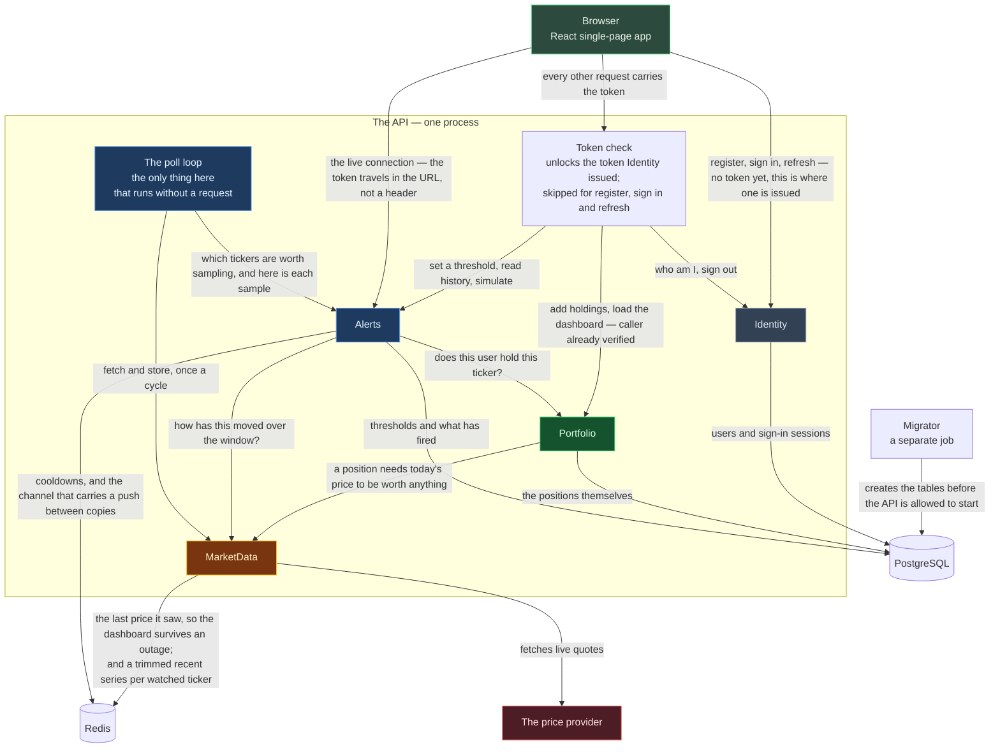

# Service interactions — who talks to what at runtime

The running system: the browser, the one process the modules live in, and the stores and services outside
it. [module-interactions.md](module-interactions.md) covers the same ground at the level of code
references and deployment; this file is the runtime picture only.

The poll loop is drawn separately from the modules on purpose. It lives inside MarketData, but it is
reached by a timer rather than by a request, and it is the reason the deployed API can no longer be left
with no copy running.

The browser is served from GitHub Pages and the API runs in Azure, so the two are always on different
addresses. Everything between them is plain HTTP with the sign-in token attached.

## Why the token check sits outside Identity

Identity **issues** the token; the host **verifies** it. Splitting those two is deliberate, and it is the
thing that would make Identity cheap to pull out into its own service.

**These are not signed tokens.** A session is an ASP.NET Core Identity bearer token: an opaque string the
framework encrypts and seals with the application's data-protection key ring, and unseals again on the way
in. There is no signing key setting, no issuer name and no audience name — all three were deleted, along
with the configuration and the deployment secret that carried them, because nothing read them. The one
thing a token check needs is the key ring, and the host already has it.

Checking a token still needs no code from Identity and no call to it, which is the point. If the check lived
inside Identity instead, then pulling Portfolio out into its own service would leave it two bad options:
carry a copy of Identity's code, or ask Identity over the network on every single request. The second turns
Identity into the thing that takes the whole system down when it stops answering.

**Extraction is harder than it was, and worth knowing before it is attempted.** A sealed token is symmetric:
whatever can open one can also make one. The key ring is a single shared secret today, and it lives in the
`marketdata` schema, so a separated Identity service would have to either share that store or move to a
scheme with two halves — one that mints and one that only checks. That is a real change of mechanism, not a
settings edit.

## What each module stores, and where

| Module | PostgreSQL | Redis | Outside |
|---|---|---|---|
| **Identity** | its own schema — user accounts and each user's appearance preferences. **No session rows**: a refresh token is sealed and self-contained, so there is nothing to store, and signing out works by rolling the user's security stamp | — | — |
| **Portfolio** | its own schema — positions | — | — |
| **MarketData** | its own schema — each user's own provider key, and the key ring that encrypts them *and* seals every session token | the last price seen for each ticker, each ticker's company name, a trimmed recent series for each watched ticker, the two poll locks, and the poll heartbeat the feed health check reads | the price provider, over HTTP |
| **Alerts** | its own schema — thresholds and fired alerts | cooldowns, and the channel that carries a pushed alert to whichever copy holds the browser's connection | — |

**MarketData was the one module with no database, and Phase 5 ended that.** Everything it kept was one value
per ticker, which expires and can be re-fetched, so a database would have bought an empty migration and a row
of bookkeeping for no behaviour. A key a user brings is the opposite kind of thing — it must survive a restart
and it must be unreadable to anyone with the raw rows — so it needs a table and the encryption keys need one
beside it.

That is why all four database logins are now real. `marketdata_svc` was created in Phase 1 and connected as
nothing for four phases.

**Each module connects as its own database user**, with no permission to read another module's schema.
That is not a convention — a query across the line is refused by the database itself.

## The one loop that runs without a request

A background loop asks the provider for prices on a timer, but **only for tickers somebody has an alert
on**. It writes a short price history to Redis, compares each new price against it, and pushes a message
to the browser over a long-lived connection when a threshold is crossed. With nobody's alert configured
the loop still wakes, finds an empty list and calls nothing.

Three things about it are load-bearing at runtime and easy to lose:

- **Two locks, not one.** One picks which copy of the app polls a given cycle; the other stops a cycle
  that overran from being joined by the next one on a different copy. Both expire, as a backstop for a
  copy that dies mid-cycle.
- **Every finished cycle leaves a heartbeat in Redis** — when it ran, how many tickers it aimed at and
  how many it stored. That single value is the whole of what the feed health check reads, which is why a
  cache outage takes the feed's health report down with it: no lease, no cycle, no heartbeat.
- **The alert is written down before it is pushed.** Whether anyone is connected only decides whether it
  also arrives now. A failed push costs nothing, because the next history load finds the row.
- **The live connection is authenticated from the URL, not a header**, and every copy of the app is joined
  through Redis so an alert produced on one copy still reaches a browser attached to another. Without that
  fan-out, alerts stop arriving for some users the moment there is more than one copy. Both are the
  real-time library's own mechanisms rather than anything written here.
